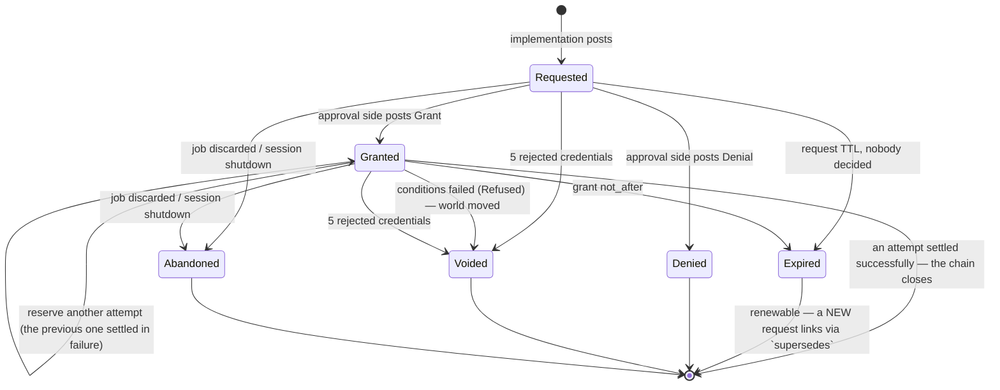
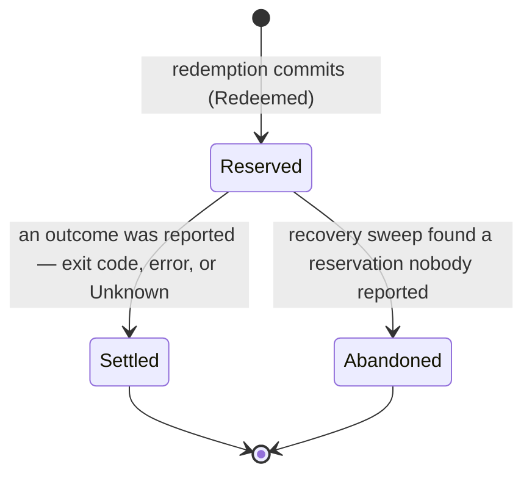

# The kaish approval ledger

**Status:** living design doc — spec current as of 2026-08-02; implementation beginning.
This file in kaish `docs/` is the canonical copy (migrated from kaish-extras 2026-08-01;
the extras copy is superseded).
**Target:** kaish kernel (post-0.13) · **Motivating embedder:** kaijutsu · **First in-kernel consumer:** kaish-git's write profile
**Inputs:** [safety-inventory](https://github.com/tobert/kaish-extras/blob/main/docs/design/safety-inventory-2026-08.md) (problem statement), [kaish-extras git.md](https://github.com/tobert/kaish-extras/blob/main/docs/git.md) §7 (first consumer), kaish `main` @ `818ff48`
**Reviews:** [gemini-pro](https://github.com/tobert/kaish-extras/blob/main/docs/design/reviews/ledger-review-gemini-2026-08.md), [gpt-sol](https://github.com/tobert/kaish-extras/blob/main/docs/design/reviews/ledger-review-gpt-2026-08.md)
**Supersedes:** the confirmation latch, which is deleted outright (see §F)

### History

Drafted 2026-08-01 by an Opus design agent from the safety inventory. Cross-model
reviewed the same day against the real tree by gemini-pro and gpt-sol (linked above);
their findings — first-class attempts, one linearization rule, drop-safe settlement, a
structurally tokenless public view, replay correlation — are folded into the spec below
rather than kept as a separate revision list. Migrated from kaish-extras to kaish `docs/`
on 2026-08-01 because this is a kernel feature and the design belongs with the kernel.
Key decisions by Amy, 2026-08-01: delete the latch with no compatibility layer, keep the
key path free of special cases, wire kaijutsu first, make `fs.*` observability an opt-in
subscription. A second cross-model consistency review followed the redraft; its findings
and Amy's 2026-08-02 rulings — pure bearer keys, one successful settlement per grant,
double-click-friendly `RequestId`s, `confirm` on the kernel with the handle as an argument —
are folded in the same way. The first hardening PR (CSPRNG tokens) landed as kaish #259 on
2026-08-02.

**The decision archaeology lives in `git log docs/approval-ledger.md`** — the original
draft, the review synthesis, the correction layers, and the conversations behind each
ruling. This body carries the settled design and nothing else; where it disagrees with an
earlier revision, this body wins.

---

## 0. The one-paragraph version

Every privileged operation in kaish posts a **request** to an append-only ledger and does
not run until a matching **authorization** exists. The implementation side has exactly one
call — `ctx.request_approval(req)` — and never learns whether the grant came from a human
at a terminal, a standing policy rule, or an embedder's hook. Only the approval side can
grant, and it grants by posting its own entry. The ledger is consistent when every
execution attempt has exactly one live grant behind it and exactly one settlement in front
of it. Nothing is cryptographic: the ledger buys *correctness under concurrency, a
readable record afterward, and a state machine whose illegal transitions are loud*, not
tamper-evidence. Every ledger append is also a tracing event or span, at the same call
site, so the audit story and the OTel story are one story.

The confirmation latch is deleted and its behavior is re-expressed on the ledger: one
operation class (`fs.*`), one policy ("ask the human"), the same `--confirm=<token>` UX,
the same exit code 2.

### Vocabulary

The ledger replaces the latch's words along with its code. These are the terms this
document uses; it does not use synonyms for them.

| Term | Meaning |
|---|---|
| **ledger** | The append-only log of approval facts plus the live state it indexes. One per kernel process (§B.1). |
| **request** | One privileged operation asking to proceed. Posted by the implementation side. |
| **grant** | One decision to allow a request. Posted by the approval side. Carries expiry and conditions, and authorizes exactly one *successful* settlement (§A.1). |
| **name** (`RequestId`) | The request's public identifier. Everything except redemption works by name (§A.2). |
| **key** (`Token`) | The redemption credential. A pure bearer credential: kernel-held, never a field of any public type, retrievable only through an `ApproverHandle`, and good for whoever presents it (§A.2, §E.1). |
| **attempt** | One execution reserved against a grant. Has its own id and its own terminal outcome (§A.1). |
| **redeem** | To reserve an attempt, by presenting a key or an internal redemption context. |
| **settle** | To record an attempt's outcome. Idempotent by `AttemptId`. |
| **standing grant** | A rule that auto-grants matching future requests, and is itself a ledger entry (§C.4). |
| **subscription** | A glob-scoped registration making matching operations `observe` (record only) or `enforce` (decide) — §C.5. |
| **authority** | Holding an `ApproverHandle`: the capability to grant, deny, revoke, and retrieve a key. |

**`latch` and `nonce` retire with the mechanism.** A latch is now a request in the
`Requested` state; a nonce is now a name plus a key. Two spellings of the retired word
survive, because the §F.2 rename table is the whole break and does not reach them: the
shell option (now `set -o approvals`), and `JobStatus::Gated` (wire spelling `"gated"`), which is
pinned. §I asks whether they should change. PR 9 updates the Terms tables in `CLAUDE.md`
and `README.md` to match this one.

### Verification notes against the tree

Claims from the safety inventory re-verified at `818ff48`; refinements worth carrying:

- `generate_nonce` (`crates/kaish-kernel/src/nonce.rs:174-191`) was confirmed non-CSPRNG
  and folded to `u32`. Fixed in kaish #259: 16 bytes from `getrandom`, 32 lowercase hex.
  The rejected-attempt limit that shipped alongside it in the original plan was
  **deliberately deferred** there, because a wrong `--confirm` guess does not identify
  which issued credential it was aimed at. The attempt model in §A.5 is what gives that
  counter somewhere principled to attach; it lands with the ledger core (§H).
- `NonceStore` uses `kaish_types::clock::Instant` for TTL (monotonic) but records no
  wall-clock time at all, so there is nothing to audit *with* even if we added a sink.
- The dispatch-seam capture (`crates/kaish-kernel/src/kernel.rs:3322`) is unconditional and
  explicitly documented as such — good, because the ledger needs the invocation on *every*
  request. It does, however, substitute an empty argv when capture is unavailable
  (`kernel.rs:3310-3321`), which §B.4 replaces with an explicit capture status.
- `async_trait` is already a dependency of `kaish-tool-api` and `Tool` already uses it
  (`crates/kaish-tool-api/src/tool.rs:19`). `ToolCtx` does not, but adding `#[async_trait]`
  to it with **defaulted** async methods is not a breaking change for existing implementors.
- `wait`'s single-latch behavior is at `crates/kaish-kernel/src/tools/builtin/wait.rs:138-140`
  (`latch.get_or_insert`), with the "first latch wins" comment intact.
- `Scope` has no readonly/pin concept of any kind
  (`crates/kaish-kernel/src/interpreter/scope.rs:602-608`) — `set +o latch` is a plain
  setter. Confirmed.
- Cancellation is cooperative and has no dropped-future callback (`ctx.rs:82-101`), and the
  dispatch seam's post-execution code runs only on normal return (`kernel.rs:3324-3340`).
  §C.1's settlement guard exists because of those two facts.

---

## A. The data model

### A.1 One log, two posting authorities, one balance rule

The ledger is a single append-only log. What makes it trustworthy is not arithmetic: it is
that **entries are posted from two sides, and neither side can post the other's**. That
split is the load-bearing property; everything else in this document serves it.

| Posting side | Held by | Entries it may post |
|---|---|---|
| **Obligations** | the implementation side — kernel gate sites, plugins via `ToolCtx` (`Requester`) | `Requested`, `Redeemed`, `Settled` |
| **Authorizations** | the approval side — human via REPL, `Approver` hook, standing policy, embedder (`ApproverHandle`) | `Granted`, `Denied`, `KeyRetrieved`, `StandingIssued`, `StandingRevoked` |
| **Derived** | the ledger itself, on observation | `Expired`, `Refused`, `Voided`, `Abandoned`, `TokenRejected` |

This is enforced by types, not convention. One log, three handles:

```rust
/// The implementation side's handle. Obtained from ExecContext / ToolCtx.
/// Can post obligations and read everything. CANNOT grant.
#[derive(Clone)]
pub struct Requester(Arc<LedgerInner>);

/// The read side. Safe to hand to anyone: pending requests, states, log tail.
/// Posts nothing.
#[derive(Clone)]
pub struct Approvals(Arc<LedgerInner>);

/// The approval side's capability. Minted once per kernel at construction and
/// handed to the embedder. No public constructor, no `Default`, no
/// `Deserialize`, not reachable from script or tool code.
#[derive(Clone)]
pub struct ApproverHandle(Arc<LedgerInner>, AuthorityId);
```

A tool holding a `&mut dyn ToolCtx` can reach a `Requester` and an `Approvals` and nothing
else. There is no method on either that produces a `Grant`. That is the whole security
model, and violating it is a compile error — which is the standard we want, given that
"the agent turns off its own gate" is the failure mode we are actually defending against.

**A grant authorizes exactly one successful settlement.** There is no redemption limit to
configure, because there is no case for a second success: repetition is a `StandingGrant`
(§C.4), which counts its uses and is auditable, or a fresh request. A **failed** attempt
does not consume the grant — a transient failure, a flaky terminal, or an agent retrying is
the honest retry ergonomic the latch's reusable nonce was reaching for, and it survives
here without the second-success hazard.

**Attempts are therefore first-class.** One request can have several attempts (each failed
one followed by another), so "the operation ran" is not a fact about a request — it is a
fact about an *attempt*. Every redemption allocates an `AttemptId`, and every terminal entry
names it. Without that, two `Redeemed(r)` followed by one `Settled(r)` is unmatchable and
the rule below is uncheckable.

```rust
/// Unique within a ledger. Allocated by the reservation that creates the
/// attempt, never by a caller.
pub struct AttemptId(u64);
```

**The balance rule**, stated once, precisely:

> An operation may execute **iff** a redemption reserved an attempt against a chain
> `Requested(r) → Granted(g)` where `g.request == r.id`, `g` had not expired, **no attempt
> against `g` had settled successfully or with `Outcome::Unknown`** (either closes the
> chain — §B.2), **no other attempt against `g` was still live**, and **every condition in
> `g.conditions` evaluated true against the world it observed**.
> Reservation appends `Redeemed{request, attempt, by}`; the attempt ends with exactly one
> `Settled{request, attempt, outcome}` or `Abandoned{request, attempt, reason}`.
>
> The ledger is consistent when: every `Redeemed` has exactly one live `Granted` ancestor;
> every `Granted` has exactly one `Requested` ancestor; every `Granted` has at most one
> successfully-settled attempt; every `AttemptId` appears in exactly one `Redeemed` and
> exactly one terminal entry. An unmatched pair is a kernel bug
> — `debug_assert!` in debug, `LedgerError::InvariantViolated` in release, and **never**
> "proceed".

An unmatched *obligation* means the operation must not run. An unmatched *authorization*
is fine — it just expires unused, and that shows in the record, which is itself useful
signal ("policy grants nobody redeems").

**Settlement is idempotent by `AttemptId`.** Settling an attempt that is already terminal
appends nothing and returns `Ok`. Two things can race to settle one attempt — the tool's
explicit `settle_with` and the dispatcher's drop guard (§C.1) — and the honest answer is
that the first one wins and the second is a no-op, not an error.

### A.2 Identity, credential, and the public view

Today's nonce is simultaneously the operation's identity, its secret, and its entire
record. That is why the record evaporates: you cannot keep an audit trail keyed on a
bearer secret without leaking it, so the only safe thing to do with a nonce is forget it.

Split them into three things — a name, a credential, and a public projection — of which the
credential never leaves the kernel:

```rust
/// The request's NAME. Public, stable, safe to log, safe to print, safe to keep
/// forever. Format: "req_{ledger_epoch:8hex}_{seq}" e.g. "req_9c1a4f2e_42".
/// Underscores throughout and no other separator, because a hyphen ends a
/// terminal's double-click selection and this id exists to be copied; the
/// "req_" prefix makes it self-identifying in a log line. There is no short
/// form: ids are printed in full and accepted in full, so an id can never be
/// ambiguous between sessions sharing a ledger.
pub struct RequestId(String);

/// The redemption CREDENTIAL. 128 bits from `getrandom`, 32 lowercase hex.
/// Lives ONLY in the kernel's credential index, keyed by `RequestId`. It is
/// never a field of any `LedgerEntry`, never a field of any public type, and
/// never serialized to a sink or the VFS. It is retrievable through
/// `ApproverHandle::token_for` and nowhere else, and it is dropped when the
/// chain closes (§B.2).
pub struct Token(String);
```

`RequestId` is what the ledger, `/v/approvals`, spans, and every human-readable surface
use. `Token` exists only to make `--confirm=<token>` work across a process boundary where
the caller cannot be authenticated any other way. §E calls the `RequestId` the *name* and
the `Token` the *key* when it contrasts them; they are the same two things.

**The public view is a distinct type with no credential field at all.** Redaction is a
convention, and a convention needs a chokepoint every path passes through — which does not
exist here: foreground results never pass through `Job::latch()` (`context.rs:759-798`
mints the request, `job.rs:223-230` only stamps the job id later). So the public surface is
tokenless *by construction*:

```rust
/// What every consumer sees: `ExecResult.approval`, `JobInfo.approval`,
/// `/v/approvals`, `--json`, an `Approver`'s input. There is no credential
/// field, so there is nothing to redact and nothing to leak through
/// clone / serde / VFS / telemetry.
#[non_exhaustive]
pub struct ApprovalRequestView { /* every §A.3 field; there is no credential field to omit */ }
```

**The key is a pure bearer credential.** Whoever presents it redeems, from whichever
session, whatever principal they are. Binding it to the requesting principal and session
was considered and rejected (Amy, 2026-08-02): an authority-holding session could then
retrieve a key it was not allowed to use, and delegation could only ever return the key to
the original requester — two special cases in the one path that must not have any, and
tunneling a key back to a model is a flow that has to work. Bearer is simple and it is the
same rule everywhere.

**Accountability is the record, not the mechanism.** Retrieval requires an `ApproverHandle`
and appends `KeyRetrieved{request, by}`; presentation appends `Redeemed{request, attempt,
by}` naming the principal that presented it. So a key that moves leaves two entries and a
name at each end. The blast radius is carried by the two limits that do not depend on who
holds the key: a grant authorizes exactly one successful settlement (§A.1), and it expires
at `not_after`.

**Threat model, stated once.** The ledger protects against command-level agents and
portable tools: an agent that can run any shell command, write any file, and read any
output cannot grant its own request. It does **not** protect against hostile Rust loaded
into the process (`as_any_mut` exists, `ctx.rs:106-121`) or against a hostile embedder,
which mints the `ApproverHandle` in the first place. There are no signatures, no hash
chain, and no monotonic-counter attestation. The ledger defends against *accident, drift,
forgetfulness, and a confused agent*, and it produces a record you can read afterward.
Pretending to more than that would be the worst thing we could ship.

### A.3 The request entry

```rust
#[non_exhaustive]
pub struct ApprovalRequest {
    pub id: RequestId,
    /// Dotted taxonomy. In-tree values come from a closed enum (see A.6);
    /// plugins register a namespace prefix at construction ("git.").
    pub operation: OperationId,      // "fs.remove", "trash.empty", "git.push"
    pub risk: RiskClass,             // Reversible | Recoverable | Irreversible
    pub resources: Vec<Resource>,
    pub principal: Principal,        // who is asking
    /// Whether this invocation can be replayed by the approval side, and why
    /// not when it cannot. Never a silently-empty argv (§B.4).
    pub capture: Capture,
    /// W3C context captured at request time — this is what lets an approval
    /// granted 40 minutes later still nest under the originating trace.
    pub context: RequestContext,     // { traceparent, tracestate, baggage }
    pub job_id: Option<u64>,
    pub reason: String,              // why the gate fired
    /// Display-only re-run template. Producer-authored, therefore untrusted
    /// text (§C.3). A literal `<token>` placeholder is substituted only by a
    /// frontend that holds an `ApproverHandle`; the string in the record never
    /// contains a credential.
    pub hint: String,
    pub requested_at: SystemTime,
    pub ttl: Duration,
    /// Set when this request renews an expired predecessor (§B.5).
    pub supersedes: Option<RequestId>,
}
```

**Resource identity that is more than a path.** This is the piece the latch structurally
cannot express and git needs:

```rust
#[non_exhaustive]
pub struct Resource {
    /// Namespace of the identifier. In-tree: "path". Plugin-registered:
    /// "git.ref", "git.remote", "git.worktree", "url", "job".
    pub kind: String,
    /// Identifier within that namespace. "/home/a/x.txt", "refs/heads/main",
    /// "origin".
    pub id: String,
    /// The state-transition claim being authorized, when there is one.
    /// This generalizes `cas_overwrite`'s snapshot-compare.
    pub transition: Option<Transition>,
}

pub struct Transition { pub from: StateClaim, pub to: StateClaim }

#[non_exhaustive]
pub enum StateClaim {
    /// The resource does not exist (pre: creating; post: deleting).
    Absent,
    /// An opaque identifier the producer will re-derive at redemption:
    /// a git oid, an etag, a generation number.
    Exact(String),
    /// A content digest. `cas_overwrite`'s prior bytes become a digest here —
    /// the ledger records the *claim*, the gate still holds the bytes.
    Digest { alg: String, hex: String },
    /// "I don't claim anything about this side." Legal, but a grant whose
    /// conditions are all `Unspecified` records that fact so an auditor can
    /// see which approvals were unconditioned.
    Unspecified,
}
```

`git push` becomes: `Resource { kind: "git.ref", id: "refs/heads/main", transition:
Some(Transition { from: Exact("a1b2…"), to: Exact("c3d4…") }) }` plus `Resource { kind:
"git.remote", id: "origin", transition: None }`. A policy can now say "auto-approve
`git.commit` where every `git.ref` matches `refs/heads/agent/*`" without string-matching a
display label or re-parsing argv — which is exactly the thing the inventory says an
embedder is forced to do today.

**Principal**, the missing "who":

```rust
pub struct Principal { pub id: String, pub kind: PrincipalKind }
#[non_exhaustive]
pub enum PrincipalKind { Agent, Human, Automation, Unknown }
```

Seeded by `KernelConfig::with_principal`, defaulting to `Unknown`. It appears on both the
request (who asked) and the grant (who decided). A grant where `decided_by ==
requested_by` and `kind == Agent` is the self-approval case — refusable by policy (§E.7),
and visible in the record whether or not the policy is on.

### A.4 The authorization entry

```rust
#[non_exhaustive]
pub struct Grant {
    pub request: RequestId,
    pub decided_by: Principal,
    pub grounds: Grounds,
    pub not_after: SystemTime,
    /// First 4 hex characters of the credential, for correlating a
    /// `TokenRejected` with the grant it was aimed at. The credential itself is
    /// never in an entry (§A.2).
    pub token_prefix: String,
    // There is no redemption limit field. Every grant authorizes exactly one
    // successful settlement; failed attempts do not consume it (§A.1). A rule
    // that should fire repeatedly is a StandingGrant with `max_uses` (§C.4).
    /// Preconditions re-verified at redemption. Defaults to exactly the
    /// transitions declared on the request's resources. An approver may
    /// **narrow** (add or tighten) and may never **widen** — enforced at
    /// post time, loud on violation.
    pub conditions: Vec<Condition>,
    pub decided_at: SystemTime,
}

#[non_exhaustive]
pub enum Grounds {
    /// A human said yes. `channel` distinguishes the REPL terminal from an
    /// embedder's out-of-band UI.
    Human { channel: String },
    /// The embedder's synchronous policy hook.
    Policy { rule: String },
    /// A standing grant already in the ledger fired. Automation is auditable
    /// because the auto-approval names the rule that produced it.
    Standing { grant: StandingId },
    /// An `observe` subscription matched (§C.5). Records the operation and
    /// proceeds; carries no permission semantics.
    Observe { subscription: SubscriptionId },
    /// The embedder granted directly through its `ApproverHandle`.
    Embedder,
}
```

The `Standing` variant is the load-bearing one for "the approval side can automate some". A
standing grant is *itself a ledger entry* (`StandingIssued`), and every request it
auto-approves produces a normal `Granted` entry naming it. There is no path by which an
operation runs without a `Granted` entry, whether a human typed `y` or a rule fired at 3
a.m. That property — one shape of record regardless of provenance — is what makes the
ledger worth reading.

### A.5 The entry log

```rust
#[non_exhaustive]
#[derive(serde::Serialize, serde::Deserialize)]
#[serde(tag = "entry", rename_all = "snake_case")]
pub enum LedgerEntry {
    Requested   { seq: u64, at: SystemTime, request: ApprovalRequest },
    Granted     { seq: u64, at: SystemTime, grant: Grant },
    Denied      { seq: u64, at: SystemTime, request: RequestId, by: Principal, reason: String },
    Expired     { seq: u64, at: SystemTime, request: RequestId, what: Expiring },
    /// The approval side retrieved the key. Appended on every retrieval, so a
    /// key that leaves the kernel has a name attached to its departure (§A.2).
    KeyRetrieved { seq: u64, at: SystemTime, request: RequestId, by: Principal },
    /// An attempt was reserved. `by` is the principal that presented the key or
    /// held the redemption context — the other half of the accountability pair
    /// (§A.2). `observed` is what the condition check saw, and when.
    Redeemed    { seq: u64, at: SystemTime, request: RequestId, attempt: AttemptId,
                  by: Principal, observed: Vec<Observation> },
    /// Preconditions no longer hold. Voids the grant and reserves NO attempt.
    /// This is `cas_overwrite`'s "file changed since the gate checked it",
    /// generalized.
    Refused     { seq: u64, at: SystemTime, request: RequestId, condition: Condition, found: StateClaim },
    Settled     { seq: u64, at: SystemTime, request: RequestId, attempt: AttemptId, outcome: Outcome },
    /// `attempt: None` means the request was abandoned before any attempt was
    /// reserved (job discarded, session shutdown). `Some` means an attempt was
    /// running and its executor is gone — which does NOT mean nothing happened.
    Abandoned   { seq: u64, at: SystemTime, request: RequestId, attempt: Option<AttemptId>, reason: String },
    Voided      { seq: u64, at: SystemTime, request: RequestId, reason: String },
    StandingIssued  { seq: u64, at: SystemTime, grant: StandingGrant },
    StandingRevoked { seq: u64, at: SystemTime, id: StandingId, by: Principal, reason: String },
    /// A bad credential was presented. `request` is `Some` when the presenting
    /// draft matched a live request (so the count means something) and `None`
    /// when it matched nothing. Carries the running count; the fifth rejection
    /// against one request voids it (§F.3).
    TokenRejected   { seq: u64, at: SystemTime, request: Option<RequestId>, attempts: u32 },
}

/// Names a resource without its transition claim: the pair an `Observation`
/// or a match result points at.
pub struct ResourceRef { pub kind: String, pub id: String }

pub struct Observation { pub resource: ResourceRef, pub claim: StateClaim, pub at: SystemTime }

#[non_exhaustive]
pub enum Outcome {
    Exit(i64),
    Error(String),
    /// The attempt's executor went away before reporting an exit code. The
    /// operation may already have taken effect — this outcome never means
    /// "nothing happened", which is why there is no `Cancelled` variant.
    Unknown { cause: LostCause },
}

#[non_exhaustive]
pub enum LostCause { Cancelled, ExecutorLost }
```

`seq` is monotonic per ledger. `at` is wall-clock, from `kaish_types::clock::system_now`,
and exists purely for the record — **all expiry math uses `clock::Instant`**, so a
wall-clock jump can neither extend nor void a live grant. This is a genuine hazard for a
system that intends to hold approvals for minutes-to-hours across a laptop suspend; call it
out in the doc comment so nobody "simplifies" it later.

No entry carries a credential (§A.2), so the whole log is safe to stream to a sink, project
into `/v/approvals`, and print. Serde is stable and internally tagged, so NDJSON is the
obvious durable form (§D.4).

### A.6 Anti-drift for the operation taxonomy

Follow `classify_command`'s template (`docs/devlog.md:1568-1585`): in-tree operations come
from a closed enum, and the mapping from enum to dotted string is an exhaustive match, so
**adding a gate site without registering its operation is a compile error**.

```rust
pub enum KernelOperation { FsRemove, FsOverwrite, FsRename, TrashEmpty }
impl KernelOperation { pub const fn id(self) -> &'static str { /* exhaustive match */ } }
```

Plugins get `OperationId::namespaced(prefix, rest)`, where the prefix is registered once at
tool-registration time. A plugin that posts `fs.remove` gets a loud rejection — the `fs.`
namespace belongs to the kernel. This is cheap and it keeps a policy engine's vocabulary
honest.

---

## B. The state machine

### B.1 The linearization contract

**An operation wins by the order in which its conditional ledger transaction commits.**
There is one critical section per ledger. A transaction reads the chain's current state,
decides, and appends — or appends nothing and returns `Err`. Nothing else orders
anything: not wall time, not the order a caller entered a function, not the order two
futures were spawned.

Everything that must be exclusive happens inside that one section:

- reserving an attempt against a grant — checking that the grant is live, that no attempt
  against it has settled successfully, that no other attempt against it is still live, and
  allocating the `AttemptId`;
- consuming a standing grant's `max_uses`;
- posting a decision (`Granted`/`Denied`) against a request that has none;
- materializing a derived entry.

**Every derived event has a uniqueness key and is idempotent.** At most one entry exists
per key; a second attempt appends nothing and returns `Ok`.

| Entry | Uniqueness key |
|---|---|
| `Granted` / `Denied` | `request_id` (a second decision is `LedgerError::AlreadyDecided`) |
| `Expired` | `(request_id, what)` — one for the request TTL, one for the grant `not_after` |
| `Voided` | `request_id` |
| `Redeemed` | `attempt_id`, allocated by the reservation itself |
| `Settled` / attempt-level `Abandoned` | `attempt_id` |
| request-level `Abandoned` (`attempt: None`) | `request_id` |

**Condition evaluation happens outside the critical section**, because it is I/O
(`StateResolver::observe`, §B.4). The observation is carried *into* the transaction and
recorded on the `Redeemed` entry, so the record states what was seen and when. This means
the ledger **detects stale authorization**; it does not make the final mutation atomic.
Closing the window is the resource's own job — for git refs, git's compare-and-swap ref
update; for files, the backend's conditional write.

**v1 is in-process only.** One `Arc<LedgerInner>`, one lock, one monotonic clock
(`kaish_types::clock::Instant`). "Kernels sharing a ledger" means kernels in the same
process sharing that `Arc` — not two OS processes, not two hosts. **There is no durability
claim**: a memory-only ledger is an *operational* ledger, and a `LedgerSink` is an export,
not a source of truth. The one thing a sink is read for is the recovery sweep (§D.4). A
cross-process protocol would need a different linearization story and is deliberately not
designed here.

### B.2 States and the attempt lifecycle

Two machines, because attempts are first-class (§A.1): one per request, one per attempt.

Request:



Attempt:



```rust
pub enum AttemptState { Reserved, Settled, Abandoned }
```

The two attempt terminals differ in what the ledger knows. `Settled` means something
reported: an exit code, an error, or `Outcome::Unknown` when the executor went away and the
guard said so (§C.1). `Abandoned` means nothing ever reported and the sweep closed the
chain. Neither means "no effect happened".

**Success is what closes a chain.** A request is closed when an attempt settled successfully
(`Outcome::Exit(0)`) or with `Outcome::Unknown` (see below), or when it can no longer
authorize an execution — `Denied`, `Expired`, `Voided`, `Abandoned` — and every attempt it
spawned is terminal. Nothing stays live because
a limit was never reached: there is no limit to reach (§A.1). Only closed chains are
evictable (§D.4), which is why the common case — one request, one grant, one attempt, one
success — costs the live index nothing beyond the operation's own duration. A refused
redemption reserves no attempt, so there is nothing to settle for it.

A **reported failure** — `Outcome::Exit(non-zero)` or `Outcome::Error` — leaves the chain
live until the grant's `not_after`, so an agent that retries has something to retry against.
That window is the one place a grant outlives its first attempt, and it is bounded by expiry
rather than by a count. `Outcome::Unknown` does **not** reopen the grant: the executor
vanished and the effects are unknown, so the honest next step is a fresh request whose
conditions are observed again, not a retry against an authorization whose premise nobody
can check.

The honest hazard in retry-on-failure: a multi-resource operation can fail after mutating
some of its resources, so a second attempt is not always a repeat of the first. §I records
that as an open requirement — it is a property of the operation, not of the ledger, and the
ledger's answer is that both attempts are in the record with their outcomes.

### B.3 The transition table (this is the test matrix)

Request level:

| From | Event | To | Entry appended | If illegal |
|---|---|---|---|---|
| — | `post_request` | `Requested` | `Requested` | — |
| `Requested` | `grant` | `Granted` | `Granted` | — |
| `Requested` | `deny` | `Denied` | `Denied` | — |
| `Requested` | TTL elapsed (observed) | `Expired` | `Expired{what: Request}` | — |
| `Requested` | `redeem` before any decision | ✗ | `TokenRejected{Some}` | `LedgerError::NotAuthorized` — exit 1, loud; no grant exists, so no key does either |
| `Requested`/`Granted` | bad key, draft matches this request | unchanged | `TokenRejected{Some, attempts: n}` | `LedgerError::NotAuthorized` — exit 1, loud |
| `Requested`/`Granted` | 5th bad key against this request | `Voided` | `TokenRejected{Some, attempts: 5}` + `Voided` | request is dead; a later *good* key fails naming the void |
| any | bad key, draft matches no live request | unchanged | `TokenRejected{None}` | `LedgerError::NotAuthorized` — exit 1, loud; no request's state moves and no count advances |
| `Granted` | `redeem`, conditions hold | `Granted` | `Redeemed{attempt, by}` | — |
| `Granted` | `redeem`, condition fails | `Voided` | `Refused` + `Voided` | operation must re-request |
| `Granted` | `redeem` while an attempt is live | `Granted` | none | `LedgerError::AttemptInFlight` — exit 1, loud |
| `Granted` | `redeem` after a successful settlement | closed | none | reports the settled outcome and does **not** re-execute (§B.4) |
| `Granted` | attempt settles `Exit(0)` | closed | `Settled` | — |
| `Granted` | attempt settles non-zero / `Error` | `Granted` | `Settled` | grant stays live until `not_after`; retry may redeem again |
| `Granted` | attempt settles `Unknown` | closed | `Settled` | effects unknown — a retry needs a fresh request |
| `Granted` | `not_after` elapsed | `Expired` | `Expired{what: Grant}` | — |
| `Granted` | `grant` again | ✗ | none | `LedgerError::AlreadyDecided` |
| `Denied`/`Voided`/`Abandoned` | anything | ✗ | none | `LedgerError::Terminal` |
| `Expired` | `renew` | new `Requested` | `Requested{supersedes}` | — |

The `TokenRejected{Some}` rows above cover the *bearer-key* redemption form (a presented
`--confirm=<token>` string, or its ledger-core equivalent). The internal-context form (the
replay path, §B.4 — no credential is presented at all, only a `RedemptionContext`) has
nothing to reject: `Requester::redeem` on a request with no live grant returns
`LedgerError::NotAuthorized` directly, with no `TokenRejected` entry, because there was no
key to count a rejection against.

Attempt level:

| From | Event | To | Entry appended | If illegal |
|---|---|---|---|---|
| — | reservation commits | `Reserved` | `Redeemed{attempt, by}` | — |
| `Reserved` | `settle(outcome)` | `Settled` | `Settled{attempt, outcome}` | — |
| `Reserved` | guard dropped (§C.1) | `Settled` | `Settled{attempt, Unknown{Cancelled}}` | — |
| `Reserved` | recovery sweep | `Abandoned` | `Abandoned{attempt, reason}` | — |
| `Settled`/`Abandoned` | `settle` again | unchanged | none | `Ok` — settlement is idempotent by `AttemptId` |

**Illegal transitions are loud, not silent, and never permissive.** Every `✗` row returns
`Err(LedgerError)`, which the gate site converts to a failing `ExecResult` — there is no
code path in which a rejected transition results in the operation proceeding. In debug
builds, transitions that indicate a *kernel bug* (rather than a user/timing error)
additionally `debug_assert!`. The distinction: `NotAuthorized`/`AttemptInFlight`/`Terminal`
are ordinary runtime outcomes; `InvariantViolated` (a `Settled` naming an unknown
`AttemptId`, a second successful settlement against one grant, a `seq` gap, a grant whose
conditions widened its request) is a bug and panics in debug.

### B.4 Replay, redemption correlation, and the precondition check

Keep the latch's replay model — not because it is proven (it works in tests and has seen
only light real use; adoption is what this design is for — Amy, 2026-08-01), but because it
is the right shape: it keeps confirmation a one-liner, and every gated operation already
has to be idempotent-on-replay by construction. Do **not** build suspend-and-resume; a tool
that gets halfway through and then asks is a tool that has already done half of something
unauthorized.

**Replay must correlate, or it posts a second request.** A bare replay re-enters the gate
site, which builds a fresh draft and would post a new `Requested` — the approval would
authorize a request nobody is waiting on. So the approval side's replay reserves the
attempt *first*:

```rust
/// Kernel-internal. Never crosses a public API, never reaches a tool.
struct RedemptionContext { request_id: RequestId, attempt_id: AttemptId }
```

`Kernel::confirm(&ApproverHandle, &RequestId)` reserves an attempt against the granted
request and dispatches the captured invocation with that `RedemptionContext` on the
`ExecContext`. When the gate site builds its fresh draft, `request_approval` sees the context
and **matches the draft against the granted operation and resources** before accepting it. A
mismatch is loud (`LedgerError::DraftMismatch`, exit 1) — the replay did not turn into the
operation that was approved. The `--confirm=<token>` path runs the same matcher after
validating the credential, so there is one acceptance contract and not two.

**`confirm` lives on the kernel and takes the handle as an argument.** Replay is an
execution, and executions belong to the kernel — an `ApproverHandle` is a ledger capability
and has no executor to dispatch with. Making the handle a required argument is what keeps
`confirm` an authority action: the signature cannot be satisfied without one, so there is no
bridge to it from anything holding only a `Kernel`. Pure-record operations — `grant`,
`deny`, `grant_standing`, `revoke_standing`, `subscribe`, `token_for` — stay methods on the
handle (§D.2).

**A key presented after a successful settlement does not re-execute.** The kernel reports
the settled outcome instead: the recorded exit code, with a message naming when it settled.
This is a deliberate break with the latch, where re-presenting a nonce silently ran the
operation again. A retry that arrives after success now gets the truth ("this already ran,
here is what it did") rather than a second deletion.

**Only exactly-captured invocations are replayable.** Today the dispatch seam substitutes
an empty argv when it has nothing (`kernel.rs:3310-3321`), which is a silent fallback into a
wrong replay. Replace it with a status:

```rust
#[non_exhaustive]
pub enum Capture {
    /// Replayable by the approval side.
    Exact(Invocation),                    // { tool: String, argv: Vec<String> }
    /// A direct `tool.execute` with no dispatch seam above it (a unit test).
    DirectExecution,
    /// The invocation cannot be represented as argv without loss.
    Unavailable { reason: String },
    /// Capture was attempted and failed.
    CaptureFailed { reason: String },
}
```

`confirm` on anything but `Exact` fails loud and names which variant it found. Those
requests are still grantable and still redeemable by presenting the key with
`--confirm=<token>`; what they are not is replayable by the approval side.

**What generalizes is `cas_overwrite`.** Today (`crates/kaish-kernel/src/tools/context.rs:269-292`)
the pattern is: snapshot bytes at gate time, re-read at write time, loud `InvalidOperation`
on mismatch, and — critically — a re-read *failure* propagates rather than defaulting to
empty. That is precisely right. Lift it:

```rust
/// A resolver the producer registers for its resource kinds. The kernel ships
/// one for "path" (digest via the backend). kaish-git ships one for "git.ref"
/// (oid via gix). Redemption calls it for every condition on the grant.
#[async_trait]
pub trait StateResolver: Send + Sync {
    fn kind(&self) -> &str;
    /// The resource's current state. An I/O failure is `Err` and refuses the
    /// redemption — never `Ok(Unspecified)`, which would silently pass.
    async fn observe(&self, id: &str) -> Result<StateClaim, ResolverError>;
}
```

Redemption evaluates each condition: `observe(resource) == condition.expected_from`. A
mismatch appends `Refused{condition, found}`, voids the grant, and returns a loud
`ExecResult`. Per §B.1 this **detects stale authorization** — it does not close the TOCTOU
window, which only an atomic conditional write at the mutation itself can do.

For git this is the whole story: approve `refs/heads/main: a1b2… → c3d4…`; if `main` moved
to `e5f6…` while the human was thinking, the push does not happen and the record says
exactly why.

### B.5 Expiry and renewal — the dead-nonce-forever fix

Today a `Latched` background job at T+61s is unfulfillable and unkillable-without-discard.
Under the ledger:

- Expiry **materializes** an `Expired` entry the first time it is observed (on any read of
  the request's state, or on the ledger's opportunistic sweep — the same place today's GC
  runs). It does not silently vanish. The record shows "nobody decided in 60s", which is a
  fact worth having.
- `Expired` is not terminal for the *thread of intent*. `Kernel::renew(request_id)` (and
  `approvals renew <id>`, and `Job::renew_gate()`) posts a **new** `Requested` carrying the
  original's operation, resources, capture, principal, and trace context, with `supersedes:
  Some(old_id)`. The chain is walkable, so "this took four attempts over two hours" is
  legible. **Renewal is a requester action, not an approval action** — the principal that
  owns the request may renew it without holding any authority, which is what lets a gated
  agent keep its own request alive.
- Renewal re-observes the transitions before posting. If the world already moved, renewal
  fails loud rather than posting a request whose claims are already false.
- `JobStatus::Latched` keeps its name and meaning ("held on an unsatisfied gate"). What
  changes is that a latched job's held request is now a ledger reference, so renewal has
  somewhere to write.

**Renewal is not re-approval.** A renewed request starts at `Requested` and needs a fresh
decision. A standing grant will auto-approve it again; a human will be asked again. That is
correct: nothing about the passage of an hour makes a stale approval better.

---

## C. The authorization handoff

### C.1 One call pattern on the implementation side

```rust
// The ONLY thing a gate site ever writes.
let attempt = ctx.request_approval(req).await.proceed()?;   // `?` returns the ExecResult verbatim
// ... perform the operation ...
```

`request_approval` returns a decision, not a bare `Result`, so an embedder-facing caller can
branch on *why* it may not proceed:

```rust
#[non_exhaustive]
pub enum ApprovalOutcome {
    /// A grant existed (or was decided inline) and an attempt is reserved.
    Authorized(AttemptHandle),
    /// No decision yet. The view is tokenless (§A.2).
    Pending(ApprovalRequestView),
    Denied { request: RequestId, reason: String },
    /// A precondition on the grant no longer holds, or could not be observed.
    /// The grant is voided and the operation must re-request (§B.4).
    Refused { request: RequestId, detail: String },
    /// This context has no ledger — a unit-test harness or a minimal embedder.
    Unsupported,
    /// The ledger refused to record: sink backpressure or live capacity (§D.4).
    LedgerUnavailable { reason: String },
}
```

**Every non-`Authorized` variant fails closed.** `proceed()` is the convenience that maps
them to the `ExecResult` a tool returns without inspection: `Pending` → exit 2 with the
view on the control-plane field; `Denied`, `Refused`, `Unsupported`, `LedgerUnavailable` →
exit 1 with a message naming the reason. This mirrors `gate_overwrites`'s existing `Err(result)`
contract (`context.rs:828`), which callers already know to return verbatim and never fall
through.

**Tools never call `settle` on the happy path, and settlement is drop-safe.** The obvious
design — the dispatch seam posts `Settled` after `tool.execute()` returns — does not fire
when the future is dropped, the task is aborted, the tool panics, or the process dies:
`kernel.rs:3324-3340` runs only on normal return, and cancellation is cooperative with no
dropped-future callback (`ctx.rs:82-101`). So settlement is a **guard the dispatcher owns**:

- The dispatcher creates an `AttemptGuard` for every attempt reserved during an invocation.
- On normal return it settles with `Outcome::Exit(code)` — one place, no forgetting.
- Its `Drop` best-effort-settles with `Outcome::Unknown { cause: Cancelled }` by pushing
  the record onto a **synchronous outbox** (a mutex-guarded queue, no `.await` in `Drop`)
  which the ledger drains on its next append and on its sweep tick. `Drop` pushes
  **unconditionally** — it does not first check whether the attempt already settled, because
  that check would need the ledger lock in a destructor. Idempotency by `AttemptId` (§A.1)
  absorbs the duplicate: a push for an already-terminal attempt appends nothing when it
  drains.
- A process that dies before draining leaves `Reserved` attempts, which the recovery sweep
  (§D.4) closes as `Abandoned`, naming the sweep in its `reason`.

The vocabulary matters as much as the mechanism: a cancelled tool **may already have
written**, so the terminal outcome is `Unknown`, never `Cancelled`-as-if-nothing-happened.
An auditor reading `Abandoned` must not conclude the operation had no effect.

A tool needing a richer outcome calls `ctx.settle_with(&attempt, Outcome::…)`; because
settlement is idempotent by `AttemptId` (§A.1), the guard's later settle is a no-op rather
than a conflict.

The tool cannot tell — and has no API to ask — whether the grant came from a human, a
policy hook, or a standing rule. `AttemptHandle` exposes `request_id()` and `attempt_id()`
and nothing about provenance.

### C.2 The decision chain

Four stages, tried in order, first non-`Defer` wins:

1. **Standing grants and subscriptions** — pure ledger lookup, no hook, no I/O, runs under
   the ledger lock. This is the auto-approve fast path, and §C.5's `observe` subscriptions
   resolve here too.
2. **`Approver::policy`** — synchronous, on the request path, contractually non-blocking.
   Suitable for allowlists, risk-class rules, and "never `git.push.force`, full stop".
3. **`Approver::decide`** — async, may take minutes. Runs under a `ctx.patient(budget)`
   hold so a human's think time does not trip the script watchdog, and `select!`s against
   the cancellation token per `ToolCtx::patient`'s contract
   (`crates/kaish-tool-api/src/ctx.rs:92-94`). **Never called while holding the ledger lock.**
4. **`Defer` all the way through** ⇒ exit 2, the request stays `Requested`, and fulfilment
   happens out of band (`--confirm=<token>`, `ApproverHandle::grant`, `approvals grant`).
   This is today's behavior, byte for byte, and it is what a non-interactive kernel with no
   `Approver` configured does.

```rust
#[async_trait]
pub trait Approver: Send + Sync {
    fn policy(&self, req: &ApprovalRequestView, ledger: &Approvals) -> Decision {
        let _ = (req, ledger);
        Decision::Defer
    }
    async fn decide(&self, req: &ApprovalRequestView) -> Decision {
        let _ = req;
        Decision::Defer
    }
}

#[non_exhaustive]
pub enum Decision {
    Grant(GrantTerms),
    Deny { reason: String },
    /// "Not my call." Falls through to the next stage. Never means "yes".
    Defer,
}
```

An approver receives the tokenless `ApprovalRequestView` — it decides, it does not redeem.
Both methods are defaulted, so an embedder implements only the half it cares about. `Defer`
as the default for both means **the trait's default behavior is today's behavior** — an
empty impl changes nothing.

### C.3 The human-in-terminal flow

The REPL installs `TerminalApprover`. Its `decide`:

- Renders the request to **the terminal**, not to stdout — the agent's output stream must
  not be the approval affordance. Shows operation, risk class, principal, and every
  resource with its transition (`refs/heads/main: a1b2c3d → c3d4e5f`). Shows `req.hint`
  last and labelled *display only*, because it is producer-authored text.
- Reads `y` / `n` / `a` / `Ctrl-C`.
  - `y` → `Grant(GrantTerms::once_for(req))`
  - `n` / `Ctrl-C` → `Deny { reason: "declined at terminal" }`
  - `a` → posts a `StandingIssued` scoped to this operation and these resources'
    *patterns* for the rest of the session, then grants. The "always" affordance and the
    audit trail are the same object.
- Runs under `ctx.patient(Duration::from_secs(300))`.
- **Non-TTY REPL** (piped script, `kaish -c`) → `Defer`. Exit 2 and the existing contract.
  No prompt is ever written to a non-terminal.

### C.4 Standing grants — automation that is auditable by construction

```rust
pub struct StandingGrant {
    pub id: StandingId,
    pub operations: Vec<OperationPattern>,     // "git.commit", "fs.*"
    pub resources: Vec<ResourcePattern>,       // { kind: "git.ref", pattern: "refs/heads/agent/*" }
    pub principal: Option<Principal>,          // None = any requester in this session
    pub max_uses: Option<u32>,                 // defaults to Some(1); None = explicit unlimited
    pub expires_at: Option<SystemTime>,
    pub issued_by: Principal,
    pub reason: String,
}
```

Matching rules, chosen for loudness:

- **All-or-nothing.** Every resource on the request must be matched by some pattern in the
  standing grant. A request touching four refs where the rule covers three **Defers** — it
  does not auto-approve the three and gate the one. Partial authorization of a batch is
  exactly how you get a surprising outcome.
- **Kind must match exactly**; only `id` is globbed (via `kaish-glob`, so the semantics are
  the ones the rest of kaish already uses).
- **Transitions are not matched, they are conditioned.** A standing grant does not care
  what the oids are; it copies the request's declared transitions into the resulting
  grant's `conditions`, so the redemption-time check still fires. "Auto-approve commits to
  `agent/*`" still fails loud if the ref moved.
- **`max_uses` defaults to 1** — a standing rule auto-approves one matching request
  unless explicitly widened (`with_max_uses`) or explicitly made unlimited
  (`unlimited_uses`); an omitted field on the wire is the one-shot default, never
  unlimited. Automation that fires repeatedly is an act the record can point to, not a
  default it fell into.
- `max_uses` is consumed inside the same critical section that appends the `Granted`
  entry (§B.1; charged at decision time — the PR 4 review settled the §C.4-versus-§B.1
  wording in favor of the concurrency test's phrasing). Exhaustion appends nothing
  special: the rule stops matching and the request Defers to the next stage. The
  `StandingIssued` entry plus the count of `Granted{grounds: Standing{id}}` entries
  reconstructs the usage history.

Revocation (`ApproverHandle::revoke_standing`) appends `StandingRevoked` and takes effect
immediately for requests not yet granted. Already-issued grants are unaffected — revoking a
rule does not retroactively unauthorize an operation that is mid-flight; it would leave a
reserved attempt with a dead grant, which is exactly the unbalanced state we forbid.

### C.5 `fs.*` observability — an opt-in, glob-scoped subscription

An operator may want a complete, typed record of every filesystem mutation an agent made,
whether or not any of it was gated. That is a subscription, not a default.

**The dominant design constraint: free when nothing is subscribed.** A `find`, `rm -rf`, or
`cp -r` over a large tree must not pay a per-path ledger cost unless an operator has asked
for it. Every gate call site (`gate_overwrites` in `tools/context.rs`, `rm`'s
`decide_rm_action`, the trash paths) takes a cheap early-out *before constructing an
`ApprovalRequest` at all*: one relaxed atomic load answering "are there any fs
subscriptions?" — almost always no, branch predicted, done — and only then a glob match.
Nothing is allocated on the unsubscribed path. This is a hard requirement, not a
nice-to-have: kaish's large-filesystem-job performance is a first-class property and the
ledger must not tax it by default.

**Two subscription modes** — the audit-versus-enforce split, which is the whole point:

- **`observe`** — matching operations post `Requested` + immediate `Granted{Observe}` and
  proceed; they never defer, never block, never prompt. This is "record everything" with no
  permission semantics. Mechanically it is a standing rule with `Grounds::Observe` (§A.4)
  that auto-grants each matching request, so the chain closes as soon as the operation
  settles successfully — or at `not_after` if it never does — and the entries become
  evictable (§B.2). It needs no new state-machine surface — the `Grounds` variant, the subscription registry, and the fast-path filter are
  the whole feature.
- **`enforce`** — matching operations go through the real decision chain (§C.2). This is
  what `set -o approvals` becomes: an enforce subscription over `fs.*`. The cutover (§H, PR 5)
  ships exactly that one degenerate case — whole namespace, no glob, no `observe` — because
  it is what replaces the flag. Glob scoping, `observe`, and the registry generalize it
  afterwards.

**Scope is a glob over (operation-class, resource path)** via `kaish-glob`: subscribe
`fs.write` + `fs.remove` under `/workspace/**` as `observe`, and everything else —
`/tmp/**`, reads, unmatched paths — stays unsubscribed and free. kaibo's likely posture is
to subscribe *nothing*: it allows all reads within its roots and consults no audit log.

**Unsubscribed and ungated means unposted.** With no subscription covering it, an `fs.*`
operation posts nothing at all — the early-out fires before a request exists. An operation
that is gated by policy always posts, because a decision has to be recorded to be made.
Those two rules together are the whole posting posture, and they replace the earlier
"gate sites always post" framing, which could not coexist with the free-when-unsubscribed
requirement.

**Prior art worth mining at implementation time:**

- **ZFS / Solaris VSCAN** (the `vscan` dataset property + `vscand`): the property being
  *off* means the hook is *not engaged* — zero cost, enforced by the property gate rather
  than a deep runtime branch. That is exactly the free-when-unused requirement, and it says
  the "is anything subscribed" check belongs as high up and as cheap as possible. VSCAN
  also carries a **scanstamp** xattr caching a content hash so an unchanged file skips
  re-scan, plus size and file-type exempt lists checked before engaging the engine — the
  kaish analogs are a per-subscription size/kind exempt filter and, later, skipping a
  re-post for state already recorded unchanged.
- **Linux fanotify** is the closer analog: it has precisely this split — *notification*
  marks (stream events, non-blocking) versus `FAN_*_PERM` *permission* marks (block for a
  userspace verdict) — and the "you pay only where you place a mark" property. A
  subscription *is* kaish's mark; `observe` is a notification mark, `enforce` is a
  permission mark.

The registry lives on the approval side and is consulted at the gate before
`request_approval` does any work. Because an `observe` subscription reduces to a standing
grant with `Grounds::Observe`, the incremental mechanism is small — the variant, the
registry with its atomic any-subscription flag, and the glob filter. It changes no default
posture, so it lands after the cutover rather than gating it (§H, PR 8).

---

## D. API surfaces

### D.1 `ToolCtx` — plugins as first-class gate producers

This is the item the git doc calls the prerequisite. Add to `kaish-tool-api`:

```rust
#[async_trait]                       // async-trait is already a dep of this crate
pub trait ToolCtx: Send + Sync {
    // ... existing methods unchanged ...

    /// Post an approval request and obtain authorization to proceed.
    ///
    /// Only `ApprovalOutcome::Authorized` may proceed. `proceed()` converts
    /// every other variant into the `ExecResult` the tool returns **verbatim**
    /// — exit 2 when a decision is pending, exit 1 for a denial, a refusal, a
    /// missing ledger, or an unavailable ledger. Never fall through on a
    /// non-authorized outcome.
    ///
    /// Default impl fails **closed**: a context with no ledger (a unit-test
    /// harness, a minimal embedder) returns `Unsupported` rather than permitting.
    async fn request_approval(&mut self, req: ApprovalRequest) -> ApprovalOutcome {
        let _ = req;
        ApprovalOutcome::Unsupported
    }

    /// Read-only view for tools that surface pending approvals (`approvals`,
    /// `wait`, `jobs`). Default: an empty view. Grants nothing.
    fn approvals(&self) -> Approvals { Approvals::empty() }

    /// Settle an attempt with a non-exit outcome. Optional — the dispatcher's
    /// guard settles anything left over (§C.1).
    async fn settle_with(&mut self, attempt: &AttemptHandle, outcome: Outcome) { /* … */ }
}
```

All three are **defaulted**, so this is additive: existing `ToolCtx` implementors compile
unchanged. The `#[async_trait]` annotation on the trait does not require existing impls to
change either, since they override no async method.

Builder for the request, because the struct is wide:

```rust
let req = ApprovalRequest::builder("git.push")
    .risk(RiskClass::Irreversible)
    .resource(Resource::transition("git.ref", "refs/heads/main",
                                   StateClaim::Exact(old_oid), StateClaim::Exact(new_oid)))
    .resource(Resource::plain("git.remote", "origin"))
    .reason("pushing to a protected branch")
    .hint("git push --confirm=<token> origin main")
    .build();                        // a draft — kernel stamps the rest
```

`ApprovalRequest` lives in `kaish-types`, so the builder produces a *draft* and
`request_approval` stamps `id`, `principal`, `capture`, `context`, `requested_at`, and
`ttl` from the context. A plugin cannot forge a principal or an invocation, and it cannot
put a credential in the `hint` because it has no way to obtain one — the literal `<token>`
placeholder is substituted by a frontend holding an `ApproverHandle` (§D.3).

**With this, kaish-git needs only `kaish-tool-api`.** No `kaish-kernel` dependency, no
`as_any_mut` downcast. That is the acceptance criterion for the `ToolCtx` PR.

### D.2 Embedder API

```rust
// KernelConfig — replaces with_nonce_store (see §F)
.with_ledger(Ledger)                         // share one ledger across kernels in this process
.with_ledger_sink(Arc<dyn LedgerSink>)       // export
.with_approver(Arc<dyn Approver>)
.with_principal(Principal)
.with_approver_handle(ApproverHandle)        // this session may grant; absent = it may not
.with_policy_pinned(bool)                    // script can't disable an enforce subscription
.with_deny_self_approval(bool)               // refuse a grant whose principal is the requester's
                                             // (default false; for multi-principal embedders — §E.7)
.with_state_resolver(Arc<dyn StateResolver>) // per resource kind

// Kernel — construction mints exactly one authority capability
fn build(config: KernelConfig) -> (Kernel, ApproverHandle);
fn approvals(&self) -> Approvals;                          // read side, no authority
async fn renew(&self, id: &RequestId) -> Result<ApprovalRequestView>;  // requester action
/// Reserve an attempt and replay the captured invocation. The handle is a
/// required argument: replay is an execution (kernel) authorized by the
/// approval side (handle), and the signature is what enforces that (§B.4).
async fn confirm(&self, by: &ApproverHandle, id: &RequestId) -> Result<ExecResult>;

// ApproverHandle — the approval side. Not constructible any other way.
// Pure-record operations only; nothing here dispatches an execution.
async fn grant(&self, id: &RequestId, terms: GrantTerms) -> Result<()>;
async fn deny(&self, id: &RequestId, reason: &str) -> Result<()>;
async fn grant_standing(&self, g: StandingGrant) -> Result<StandingId>;
async fn revoke_standing(&self, id: &StandingId, reason: &str) -> Result<()>;
async fn subscribe(&self, s: Subscription) -> Result<SubscriptionId>;   // §C.5
fn token_for(&self, id: &RequestId) -> Option<Token>;      // appends KeyRetrieved (§A.2)

// Approvals (read side)
fn pending(&self) -> Vec<ApprovalRequestView>;    // the primitive the inventory asks for
fn state(&self, id: &RequestId) -> Option<RequestState>;
fn get(&self, id: &RequestId) -> Option<RequestChain>;  // request + decision + attempts
fn standing(&self) -> Vec<StandingGrant>;
fn log(&self, since: u64) -> Vec<LedgerEntry>;          // seq-cursored
```

**Where the handle comes from.** `Kernel::build` mints exactly one `ApproverHandle` and
returns it to the embedder, which decides which sessions get a clone. A session that should
hold authority — the REPL, a human UI session, a clearance session — is built with
`with_approver_handle`; every other session is built without it and has no method that
grants. That is the same capability, passed or withheld, and it is why "approval authority"
in this document means "holds an `ApproverHandle`".

`confirm` keeps its semantics — replay the exact captured invocation, retire the
originating job on success — and keeps its home on `Kernel`, gaining the handle as a
required first argument (§B.4). The replay executes with `req.context.traceparent` as the
parent, so an out-of-band approval nests under the trace that requested it, and it is
refused on any `Capture` variant but `Exact` (§B.4).

### D.3 Script and agent surface

**`--confirm=<token>` and exit 2 are unchanged.** This is the contract with the widest blast
radius and the one that has been proven by 60+ tests; it does not move.

**Authority's privilege is retrieval, and the key path has no special cases**
*(Amy, 2026-08-01: "I think we should be consistent. If a session has authority, it can get
the key and use it.")* The public exit-2 surface carries an `ApprovalRequestView` with no
credential field at all (§A.2), in every session, with no redaction step anywhere. What
differs is what a frontend can *retrieve*:

- A session **holding an `ApproverHandle`** (the REPL default) calls `token_for(&id)` and
  renders the full `--confirm=<token>` re-run line by substituting the `hint`'s `<token>`
  placeholder. Today's human UX, unchanged.
- A session **without** the handle (the `agent()` / `agent_with_root()` / `isolated()`
  default) has no method that returns a credential. Its exit-2 message is `pending approval
  <request-id> — an operator must grant it`. The agent can see, renew, and reason about its
  pending requests; it cannot redeem them.
- Exactly one builtin bridges to the approval side — `approvals` — and only through a
  handle installed on the session. Every other builtin has no path to `grant`, and a test
  asserts that (§H).

This is also the answer to "should `Irreversible` refuse `--confirm` entirely?" — **no**
(Amy, 2026-08-01). A second redemption path for `Irreversible` alone would fork the
redemption contract exactly where predictability matters most, and `Irreversible` is no
longer a special case anyway: **every** grant is good for one successful settlement (§A.1).
The bearer risk is handled where it belongs — one success, an expiry, retrieval that
requires authority and appends `KeyRetrieved`, and a presentation that appends the
presenting principal. An operator who hands a key to an irreversible operation is making
that choice deliberately, and both ends of the handoff are in the record.

New builtin, `approvals`, a subcommand tool (`ToolSchema.subcommands`, clap per the house
pattern):

| Command | Behavior |
|---|---|
| `approvals list [--pending\|--all\|--standing]` | typed `OutputData`, `--json` via the kernel |
| `approvals show <id>` | full request + decision + attempt chain |
| `approvals log [--since <seq>]` | the retained entries, seq-ordered; the record §E reads |
| `approvals renew <id>` | post a superseding request; loud if the world already moved |
| `approvals grant <id> [--until <duration>]` | **requires an `ApproverHandle` on the session**; there is no `--once` flag, because every grant is once (§A.1) |
| `approvals deny <id> [--reason R]` | requires the handle |
| `approvals revoke <standing-id>` | requires the handle |

**The authority check is the single most important new property.** Without a handle,
`approvals grant` fails with exit 1 and a message naming the reason. The agent can *see*
what is pending and *renew* it; it cannot approve itself. Anything else makes the whole
exercise theater, given that the agent's whole job is running shell commands.

**Multi-pending gates.** `ExecResult.approval` stays a single `Option<Box<…>>` — one
operation, one request; widening it to a `Vec` would push the multiplicity into every
consumer for a rare case. The fix is that the pending set is now a first-class queryable
primitive. `wait` on several gated jobs still surfaces the first request (unchanged code
shape at `wait.rs:138-140`) but its message becomes ``"3 approvals pending — run `approvals
list`"``, and `/v/approvals/pending` enumerates all of them.

**VFS surface** (`/v/approvals`, precedent `/v/jobs/{id}/latch`):

```
/v/approvals/
├── pending                  # JSON array of pending ApprovalRequestView
├── standing                 # JSON array of live StandingGrant
├── log                      # NDJSON of the retained log, seq-ordered
└── <request-id>/
    ├── request              # ApprovalRequestView as pretty JSON
    ├── state                # "requested" | "granted" | "expired" | …
    ├── attempts             # JSON array of attempts with their outcomes
    └── grant                # Grant JSON or empty
```

**Read-only, enforced.** A write to anything under `/v/approvals` returns `Unsupported`,
loudly. Granting via a file write would make "the agent can write files" equivalent to "the
agent can approve its own operations", which is the exact hole we are closing. No
projection needs a redaction pass, because no projected type has a credential field.

`/v/jobs/{id}/latch` becomes `/v/jobs/{id}/approval`, same shape (pretty JSON or empty
body).

### D.4 Persistence, backpressure, and recovery

**In-memory first, like `NonceStore`**, but with a record shape designed for a sink from day
one.

```rust
pub struct LedgerConfig {
    /// Maximum LIVE (unclosed) requests. Default 1024. Closed chains do not
    /// count against it.
    pub live_capacity: usize,
    /// Per-principal share of `live_capacity`. Default 256 — one principal
    /// cannot starve the others.
    pub live_capacity_per_principal: usize,
    /// Retained closed entries, oldest evicted first. Default 4096.
    pub retained_entries: usize,
    /// Bounded sink queue. Default 1024 entries.
    pub sink_queue: usize,
    pub request_ttl: Duration,        // default 60s — today's nonce TTL
    pub max_token_attempts: u32,      // default 5
}

pub trait LedgerSink: Send + Sync {
    /// Append. A sink error **fails the request closed** — an unrecorded
    /// privileged operation is exactly the corruption we refuse.
    fn post(&self, entry: &LedgerEntry) -> Result<(), LedgerSinkError>;
}
```

**Partitioned retention.** Live chains and closed chains are retained separately. A closed
chain (§B.2) streams to the sink and becomes evictable; the live index holds everything
still capable of authorizing an operation. Eviction never touches a live chain. When the
*live* index is full, the next `post_request` **fails loud** — `LedgerUnavailable`, exit 1,
`"approval ledger at capacity (1024 live requests) — settle or abandon pending approvals"` —
rather than dropping a record. It is exit 1 and not exit 2 because exit 2 means "a decision
is pending", and there is no request to decide. That is crash-over-corruption applied to
memory pressure, and it is a real
scenario for a long-running agent that gates thousands of operations and never settles
them. Per-principal quotas and a `ledger.live_requests` metric make the DoS case visible
before it becomes an outage.

**Sink backpressure fails closed, and never blocks the reactor.** The sink is fed by a
bounded async queue of 1024 entries. When the queue is full, the ledger does not block the
executor and does not drop audit records: it refuses new privileged operations with
`ApprovalOutcome::LedgerUnavailable { reason: "audit sink backpressure" }`, which is exit 1
at the gate site. Already-granted attempts settle normally, so nothing is left half-done.
An embedder that writes to a network log and cannot tolerate its unavailability should
buffer internally and return `Ok`, accepting the buffering risk explicitly. The kernel will
not make that call silently — that line belongs in `EMBEDDING.md`.

**Recovery.** On construction with a sink that supports replay, the ledger reads back the
tail and appends `Abandoned{attempt, reason: "process exited mid-attempt"}` for every
`Redeemed` with no terminal successor. A periodic sweep does the same for attempts whose
guard was dropped without draining the outbox (§C.1). Without that sweep, a ledger
accumulates permanently unbalanced chains and the invariant becomes unenforceable.
Restart-time recovery *from* the sink is explicitly deferred: `LedgerSink` (§D.4, as
shipped in ledger PR 2) is post-only — there is nothing to read back through it — so
construction-time reconstruction from prior sink output needs a separate, future
recovery-source API, consistent with §B.1's "v1 is in-process only, no durability claim."
The periodic sweep (in-process, no restart involved) is what ledger PR 2 actually ships.

---

## E. Separation of duties — who may approve, and where the boundary is real

Three questions drive this section: how do approvals work when a model drives the CLI, how
do we keep a smart model from approving its own operations, and how do we scope the inverse
— a small fast model doing per-command clearance. The answers are structural, and the rest
of the design exists to make them enforceable.

### E.1 The name and the key

The old latch nonce was one string doing two jobs: it *identified* the request and it
*redeemed* it. The ledger splits those (§A.2):

- **`RequestId`** is the request's **name**. Public by design — safe to print, put in a
  tool result, hand to anyone. Everything about the request except redemption works by
  name: inspect it, renew it, approve it, deny it.
- **`Token`** is the **key**. A secret credential the kernel holds; no public type has a
  field for it, and only a session holding an `ApproverHandle` can retrieve it (§D.3). An
  authority-less session never sees it — not redacted out, never present. It is a **bearer**
  credential: whoever presents it redeems, from any session (§A.2). That is what makes
  handing one over a deliberate act rather than a routing detail, and both the retrieval and
  the presentation are named in the record.

This split is what makes every flow below enforceable. A gated model holds the *name* of
its request and can talk about it freely; it never holds the *key*. And the governing
principle: **approval is a property of the channel it arrives on, not of any text.** A
model replays anything that enters its transcript — a key printed to stdout, echoed by a
prompt, or readable in a file is a key the model holds, whatever the surrounding prose
says. So every enforcement question reduces to *which connection can post the grant*, never
*who knows the magic string*.

**What is the key for, then?** In every channel-authenticated flow below, approval is a
record update by name — the ledger append *is* the authorization, and the key never moves.
The key does exactly one job: **it redeems a specific request without the redeemer being
channel-authenticated as an approver** (§A.2 says the same from the data-model side). Two
uses:

- **The human contract.** `rm x` → exit 2 → `rm x --confirm=<key>`. The kernel cannot
  authenticate who types into a pty; presenting the key is proof of having seen the
  approval surface. This is the contract §D.3 keeps.
- **Deliberate delegation.** The authority side judges the request and hands the key to the
  requester, which re-runs and unlocks itself — exactly one redemption, no standing power,
  and the key dies at settlement (§A.2). Under §D.3 delivery, a key reaching a gated
  session is always a deliberate act by an authority holder, never ambient.

**The key path has no special cases** *(Amy, 2026-08-01: "I think we should be consistent.
If a session has authority, it can get the key and use it.")* Redemption is always "present
the key"; `--confirm` takes keys, never names. Authority's privilege is *retrieval* — an
authority-holding session gets the key (`ApproverHandle::token_for`, §D.3) and uses or
hands over the same key everyone else would. That said, prefer the record update in
channel-authenticated embedders: a handed-over key is a bearer credential sitting in the
requester's transcript, so delegate it only when you *want* the requester to perform the
unlock itself.

### E.2 The enforcement ladder

Three tiers. Each is real against a different adversary, and each weaker tier is honest
about what it does not hold against.

1. **The type system (in-process, free).** `Requester` has no method that produces a
   `Grant` (compile-fail tested, PR 2); `ApproverHandle` has no public constructor, is
   minted once at kernel construction, and is absent from
   `agent()`/`agent_with_root()`/`isolated()` sessions; no builtin but `approvals` bridges
   to it. Holds against command-level agents and portable tools. Does not hold against
   hostile loaded Rust or a hostile embedder — stated threat model (§A.2), not a gap.
2. **The session boundary (embedder wiring).** A multi-session embedder assigns principals
   and hands authority to some sessions and not others. The kernel enforces the split; it
   trusts the embedder's principal assignment, so this tier is as strong as the embedder's
   session authentication and no stronger. The kaibo and kaijutsu walkthroughs below both
   live here.
3. **The OS boundary (user-added).** When it matters, the approval side runs where the
   model's process cannot reach: a separate process, a socket with its own permissions, a
   different uid, a sandbox that denies the model's side the approval surface entirely. One
   binary serves the REPL, `kaish -c`, and an MCP server, so the boundary is never *which
   binary* — it is session configuration plus whatever walls the user adds. kaish supplies
   the seams (exit 2 with a request id, a pluggable `Approver`, `LedgerSink` for a durable
   record); sandboxed agent environments (the codex-style direction) are where this tier
   gets cheap, and the design should assume they improve rather than contort tiers 1–2 to
   imitate them.

### E.3 Walkthrough: a model driving the bare CLI

A model runs kaish directly — the REPL or `kaish -c` — in a session constructed without
authority. A gated operation posts to the ledger and exits 2 carrying the RequestId, the
full structured request (operation, risk class, resources, transitions), and no key. The
model cannot proceed and cannot self-redeem. What it *can* do is relay — the exit-2 message
tells it exactly what to say: `pending approval <request-id> — an operator must grant it`.
Then, by where the human sits:

- **Human shares the kernel** (a REPL the human is watching): the human grants from their
  own seat — `approvals grant <id>` in an authority-holding session, or the
  `TerminalApprover` prompt (§C.3), which renders to the terminal precisely so the approval
  affordance is not the model's output stream.
- **The kernel is transient** (the model ran `kaish -c` inside its own sandbox): there is
  nothing durable to grant against, and that is the honest answer — the human re-runs the
  operation from their own shell, where they hold authority. The request record still tells
  them exactly what was attempted, against which resources. A cross-invocation grant path
  (durable ledger + control socket) is possible on top of `LedgerSink` but is deliberately
  not designed here; do not build it speculatively.

One human and one model sharing one pty is below the resolution of tiers 1–2: the kernel
cannot tell who typed. That case belongs to tier 3 (the harness's own approval prompt, or a
sandbox) and this doc never claims otherwise.

### E.4 Walkthrough: kaibo — the client model holds the authority

kaibo's `run_kaish` gives a subagent a kernel session with no authority. The subagent hits a
gated operation; the tool result returns exit 2 with the RequestId and the structured
request — which lands in front of the **client model** driving kaibo. The client model
reads the request and judges it: "yeah, that's good" or "no, bad subagent." It approves
through a dedicated tool call **the subagent does not have** — kaibo, as the embedder,
holds the `ApproverHandle` and calls the kernel's approval side. The control holds because
the two models sit on different channels: the subagent's session can name its request and
nothing more; the approval tool exists only on the client model's side of the MCP boundary.

After judging, the client model has two ways to complete the operation. `grant(id)` is the
enabling record update under both — it authorizes, but something still has to redeem:

- **Confirm** (`Kernel::confirm(&handle, &id)`): the kernel replays the exact captured
  invocation itself and the operation completes without the subagent lifting a finger.
  Smoothest, but only `Capture::Exact` invocations are replayable (§B.4).
- **Key handoff — the subagent unlocks itself.** The client model's authority lets it
  retrieve the key; it hands the key back in the tool result, and the subagent re-runs with
  `--confirm=<key>` — the same key path as everywhere else (§E.1), no special case. This
  keeps the subagent in the loop: it notices the gate, receives the judgment, performs its
  own unlock, and sees the result — right when the client model wants it to adapt rather
  than be silently unblocked.

Either way the client model approves by *name*; the key travels only when the client model
deliberately delegates the redemption. There is no "send the key to the approver" path and
none should be added — the approver *retrieves* it (§E.1).

### E.5 Walkthrough: kaijutsu — the human approves via the UI

kaijutsu is the motivating embedder for this design, and this is the flow it wires. The
agent session calls kaish; a gated operation fires kaijutsu's approval hook; kaijutsu pops
a dialog; the human clicks go; the click reaches the kernel's approval side and the ledger
posts the grant. That flow has two shapes in the design, and kaijutsu will likely want
both:

- **Blocking** — the hook is `Approver::decide` (§C.2 stage 3). The gated operation never
  returns exit 2 at all: it *waits*, under a patient hold so the watchdog does not fire,
  while the dialog is up. The click makes `decide` return `Grant` and the operation
  proceeds inline. The agent never sees a pause it has to reason about. Right for
  foreground work with the human at the screen; bound it with a decide budget (say five
  minutes).
- **Deferred** — `decide` returns `Defer` (or its budget expires). Exit 2 surfaces, the job
  sits `Latched`, the dialog can fire whenever, and the human's later click hits `confirm`,
  which replays. Right for background jobs and walked-away humans. This is today's latch
  flow, kept.

Either way the ledger entries are the same — `Requested`, `Granted`, `Redeemed`, `Settled`,
with the human's principal on the grant. Only *who waits* differs.

### E.6 The clearance officer — a small model as `Approver::decide`

The inverse of §E.4: there the big client model clears for a constrained worker; here a
haiku-class model does per-command clearance for a bigger one. It sits in the decision
chain's stage 3 (§C.2), and the boundaries that make it safe are structural, not
prompt-side:

- **Scope by chain position, not by prompt.** A stage-2 `policy` wrapper force-`Defer`s (or
  denies) everything the clearance model must not decide — `RiskClass::Irreversible`
  escalates to a human without the model ever being asked. Telling the model "never approve
  irreversible operations" is theater; filtering what reaches it is enforcement.
- **Input discipline.** The clearance model reads the *structured* request — operation,
  risk class, resources, transitions, principal — and treats requester-authored strings
  (`reason`, `hint`) as untrusted display text, the same rule §C.3 already applies to
  humans. Requester prose is an injection channel into the approver; fence it or exclude
  it.
- **Output discipline.** `Grant(GrantTerms::once_for(req))`, `Deny`, or `Defer` — a
  clearance model never issues standing grants and never widens terms beyond the request in
  front of it.
- **Identity and audit.** The clearance model is its own principal; its grants carry
  `Grounds` naming it, so `approvals log` distinguishes machine clearance from human
  judgment.
- **Never both hats.** The clearance session holds authority and posts no requests; the
  worker session posts requests and holds no authority. One session with both roles is
  self-approval with extra steps.

### E.7 Self-approval: capability first, principal-distinctness as policy

The primitive is the **capability** (the `ApproverHandle`), not identity — because a solo
human at the REPL is legitimately both requester and approver, and a blanket
approver≠requester invariant would break the oldest flow in the system.
Principal-distinctness is instead an opt-in policy for multi-principal embedders:
`deny_self_approval` — a grant whose issuing principal equals the request's principal is
refused, loud, naming both. Its job is catching *misconfiguration* (an agent session
accidentally handed a handle), not resisting an attacker. Either way the ledger records
both principals on every grant, so even where the policy is off, self-approval is visible
in the record rather than silent.

### E.8 What these use cases ask of the API

The walkthroughs above are use cases, not requirements — kaish's job is the right API (Amy,
2026-08-01: *"kaish focuses on the right api"*). What they ask of it:

1. **Batch grant is UX, not a ledger primitive.** A client model reviewing a stacked queue
   (`approvals list --pending`) wants `approvals grant` to take multiple ids or a filter;
   the ledger still posts per-request entries, so bulk approval changes no invariant and
   the record stays per-operation.
2. **A request must be judgeable from structure alone.** Every approver in §E.3–E.6 —
   human, client model, clearance model — judges operation + risk class + resources +
   transitions, never a shell command string. A narrow-toolset worker (a future
   kaibo-coder: essentials like `cargo build`, possibly dynamic tools) has no command line
   to show, and dynamic tools post their own operations through `ToolCtx::request_approval`
   (PR 3). This hardens the §A.6 taxonomy rule from "nice for audit" to load-bearing: if an
   operation's resources don't carry enough to judge it, review degrades to
   rubber-stamping.
3. **The name-only view suffices for every remote approver.** Grant and confirm work by
   RequestId; the key never travels to the approval side.
4. **Standing-before beats bulk-after for the repetitive tail.** Forty identical
   `cargo.build` approvals invite rubber-stamping; the better move is one scoped
   `StandingGrant` (operation-and-resource patterns, `max_uses`, expiry) issued by whoever
   holds authority, with the novel remainder coming through for individual review. One rule
   entry plus countable uses is a *better* audit record than forty stamps.
5. **A model approver is never silent in the record.** Grants carry the approving principal
   and grounds, so `approvals log` reads "granted by <client-model>" or "granted (standing,
   issued by <client-model>)". Rubber-stamping may happen; invisible rubber-stamping
   cannot.

---

## F. What the latch was, and how it maps

The confirmation latch is deleted — *"it never felt complete, which is why we're here"*
(Amy, 2026-08-01). No compatibility shim, no `LatchRequest` projection, no parallel
representation: `NonceStore` and `NonceScope` are removed in the same change that rewrites
the ten gate sites, per the no-legacy-dual-representations rule. This section exists so a
reader who knows the latch can find the concept they are looking for.

### F.1 The mapping

| Latch concept | Ledger concept |
|---|---|
| `NonceStore` | `Ledger` (record) + kernel-internal credential index (§A.2) |
| nonce (32 lowercase hex since kaish #259, identity + secret + record) | `RequestId` (name, public) + `Token` (key, 128-bit CSPRNG, kernel-held) |
| `NonceScope { command, paths }` | `ApprovalRequest { operation, resources }` |
| subset-of-paths validation | resource-set match + per-resource conditions |
| `set -o latch` | `set -o approvals` — an enforce policy over the whole `fs.*` namespace, which §C.5 later generalizes to a subscription |
| `set +o latch` | `set +o approvals` — removing that policy, refused under a pin (§F.3) |
| `kaish-trash empty`'s unconditional gate | an always-enforced operation, independent of any subscription |
| `latch_result` | `ctx.request_approval` (kernel-internal helper on top) |
| `gate_overwrites` | unchanged signature; reimplemented on `request_approval`, with `cas_overwrite`'s snapshot digest becoming a `Condition` |
| `Kernel::confirm(&req)` | `Kernel::confirm(&handle, &request_id)` — same replay semantics, authority now in the signature (§B.4) |

**What the latch could not express**, and why the mapping is a rewrite rather than a rename:
a nonce has no principal, no wall-clock record, no decision provenance, no per-resource
state claim, no notion of a second attempt, and no life after it is forgotten. Every one of
those is a field above.

### F.2 What stays stable, what breaks

**Stable — does not move:**

- Exit code **2** means "authorization required".
- The `--confirm=<token>` flag spelling, and its per-builtin declaration.
- `confirm`'s semantics: replay the exact captured argv, retire the originating job on
  success.
- The control-plane discipline: never folded into `.data`, survives `clear_stdout`,
  survives the `ExecResult`↔`ToolResult` roundtrip, survives `--json`, overrides a later
  pipeline stage's success, rides `scatter`/`gather` rows.
- The *meaning* of the held-job status — a job waiting on an unsatisfied gate, distinct
  from `Failed`. Its **name** changes (see the table below); what does not change is that
  a held job is never reaped, never reported as `Failed`, and never silently discarded.

**Breaking — one `**BREAKING:**` changelog bullet each:**

| Was | Becomes |
|---|---|
| `ExecResult.latch: Option<Box<LatchRequest>>` | `ExecResult.approval: Option<Box<ApprovalRequestView>>` |
| `ExecResult::latch_request()` | `ExecResult::approval_request()` |
| `--json` envelope key `"latch"` | `"approval"` |
| `KernelConfig::with_nonce_store(NonceStore)` | `KernelConfig::with_ledger(Ledger)` |
| `kaish_kernel::nonce::{NonceStore, NonceScope}` | removed |
| `Kernel::confirm(&req)` | `Kernel::confirm(&handle, &request_id)` |
| re-presenting a nonce after success re-ran the operation | a key presented after a successful settlement reports the settled outcome and does not re-execute (§B.4) |
| `/v/jobs/{id}/latch` | `/v/jobs/{id}/approval` |
| `JobInfo.latch: Option<LatchRequest>` | `JobInfo.approval: Option<ApprovalRequestView>` |
| `set -o latch` / `set +o latch` | `set -o approvals` / `set +o approvals` (and `KAISH_LATCH` → `KAISH_APPROVALS`, `KernelConfig::with_latch` → `with_approvals`) |
| `JobStatus::Latched`, wire `"latched"` | `JobStatus::Gated`, wire `"gated"` |

Keeping `LatchRequest` as a compatibility projection was considered and rejected twice, on
independent grounds: `LatchRequest` is `#[serde(deny_unknown_fields)]` (`result.rs:72-74`)
and serialized directly, so a projection is only byte-compatible while it is lossy — and
maintaining a lossy second representation of the same record is what the contributor
conventions forbid. Two embedders, one maintainer, pre-1.0: take the break once and
cleanly. The changelog carries the rename table verbatim.

### F.3 The hardening the cutover carries

**1. CSPRNG credentials — landed.** kaish #259 replaced `generate_nonce`'s `RandomState +
SystemTime → u32` with 16 bytes from `getrandom` rendered as 32 lowercase hex, and made
entropy failure a loud error rather than a fallback. The ledger's `Token` is that
generator.

**2. The rejected-attempt limit.** #259 deferred this deliberately: a wrong `--confirm`
guess did not identify which nonce it was aimed at, so a counter had nowhere principled to
attach. The draft matcher (§B.4) is what fixes it — a presentation arrives with a fresh
draft, and the draft names the request even when the key is wrong. So a bad key whose draft
matches live request R appends `TokenRejected{request: Some(R), attempts: n}` and counts
against R; a bad key matching no live request appends `TokenRejected{request: None}` and
counts against nothing, so a guesser cannot void a request it cannot describe.

`max_token_attempts` defaults to **5**: the **fifth** rejection against one request appends
its `TokenRejected` and then `Voided`. A *correct* key presented after the void fails loud
with "request voided after 5 invalid attempts" — the operator learns something happened,
rather than a valid key mysteriously not working.

**3. Pinning the policy.** `set +o latch` from script code is the hole that makes the whole
thing advisory. `Scope.policy_pinned`, seeded from `KernelConfig::with_policy_pinned`, never
settable from script, copied into forks and pipeline stages exactly where the option's own
flag already is (`kernel.rs:5554-5561`, and `Kernel::reset`). Changing the policy under a
pin returns **exit 1** with `"approval policy: pinned by the embedder; cannot be disabled
from script"` — loud, not a silent no-op, because a silent no-op teaches an agent that its
`set +o approvals` worked. The pin fixes the policy in **both** directions: an embedder that
pinned the gate off is equally entitled to that decision. It covers the `-o`-split fallback
path in `set.rs` so the flags-versus-positional parse quirk cannot route around it, and it
generalizes to any script-reachable policy mutation the ledger adds.

*Found at implementation time:* `set` is a grammar keyword in kaish, so `$(set +o
approvals)`, `set +o approvals | cat`, and `set +o approvals &` are **parse errors** — three
of the four shapes this item worried about never reach the builtin at all. That is a
stronger guarantee than the refusal, but it belongs to the grammar rather than to the pin,
so the pin still has to hold on its own: if `set` ever becomes an ordinary command those
shapes start reaching the builtin, and the refusal is what catches them. This was originally planned as a
standalone PR against `NonceStore`; it moved into the cutover because hardening a structure
that is about to be deleted is wasted motion (§H).

**4. Single successful redemption, universally.** Today's nonce is reusable within its TTL
(`nonce.rs:124`, tests at `:209-217`), so one approval can run a destructive operation
repeatedly and silently. Under the ledger every grant authorizes exactly one *successful*
settlement — no risk-class exception, no configurable limit (§A.1). The ergonomic that
reuse was protecting is kept by the narrower rule that a **failed** attempt does not consume
the grant, so a transient failure or a dropped terminal still retries inside `not_after`.
`RiskClass` stops carrying redemption policy entirely and goes back to being what an
approver reads and a policy matches on.

Repetition that is genuinely wanted has a first-class home: a `StandingGrant` with
`max_uses` (§C.4), which is a rule with a name, a count, and an entry — an auditable
multi-use form, which a reusable key never was.

**5. Adjacent, not in this design's path.** These are real and tracked in the PR that
touches them, not blockers here:

- `KAISH_APPROVALS` / `KAISH_TRASH` are read from `std::env` inside four kernel presets
  (`kernel.rs:382, 502, 538, 567`). The right fix is for the *frontend* to read env and pass
  `KernelConfig`; the kernel presets should not touch `std::env`. The direction is safe
  today (env can only turn a rail on), and the cutover footnoted the hermeticity claim in
  `EMBEDDING.md`'s "Initial Variables and Hermetic Subprocess Env" section rather than
  leaving it silently inexact. Moving the reads out to the frontend is still open.
- `--confirm` has no schema-level marker, so a policy engine cannot discover gateable
  operations from `tools --json`. Under the ledger the discoverable thing is the *operation
  taxonomy*, not the flag — add `ToolSchema.operations: Vec<OperationId>` so `tools --json`
  advertises what a tool can request.
- `cas_overwrite` is still not OS-atomic (no write-temp-then-rename primitive). Unchanged by
  this design, and per §B.1 the ledger does not claim to fix it.

---

## G. Spans and events

Follow `telemetry.rs`'s established shape: `#[instrument]` spans where the duration is
meaningful and the call site is off the hot recursion ring; `tracing::` events where it is
on it. The dispatch seam's breadcrumb-not-span choice (`kernel.rs:3091`, GH #48 item 3) is
respected — nothing this design adds wraps `execute_command_depth`'s future.

**Ledger appends and span/event emissions share one call site.** `LedgerInner::append(entry)`
emits the corresponding event; there is no second place where a ledger fact can be recorded
without a trace fact, and vice versa. That is the mechanism that makes "the OTel story and
the audit story are the same story" true rather than aspirational.

**Short spans, linked — not one span held open across a human's think time.** A span open
for minutes is unusual, and several backends handle it badly. The decision latency is still
measurable: it is the `approval.decide` span's duration, and the spans are correlated by
`approval.request_id` and `approval.attempt_id`, which are attributes on all of them.

| Span | Level | Where | Attributes | Notes |
|---|---|---|---|---|
| `approval.request` | info | `ExecContext::request_approval` | `approval.request_id`, `approval.operation`, `approval.risk`, `approval.resource_count`, `approval.principal`, `job_id` | Closes when the request is posted and the fast stages have run — **not** held across an out-of-band wait. |
| `approval.decide` | info | around `Approver::decide` only | `approval.request_id`, `approval.stage` (`standing`\|`policy`\|`human`), `approval.decision`, `approval.grounds`, `approval.decided_by` | This is where decision latency lives, including a human's 40 seconds. Linked to `approval.request`, not nested in it. |
| `approval.attempt` | debug | reservation through settlement | `approval.request_id`, `approval.attempt_id`, `approval.conditions_checked`, `approval.outcome` | The execution half. Records `err` on refusal. Debug because it is per-execution. |
| `approval.confirm` | info | `Kernel::confirm` | `approval.request_id`, `approval.attempt_id`, `approval.tool` | `confirm` sits *outside* the `execute_argv` span it then creates, so this correctly parents the replay. |

### Events

Emitted at the append site, one per entry variant:

`approval.requested` (info) · `approval.granted` (info) · `approval.denied` (info) ·
`approval.expired` (info) · `approval.key_retrieved` (info, carries `approval.retrieved_by`)
· `approval.redeemed` (debug) · `approval.refused` (**warn** —
preconditions failed, the world moved under an approval) · `approval.settled` (info) ·
`approval.abandoned` (**warn** — an attempt ended with `Outcome::Unknown`, so effects are
unknown) · `approval.voided` (warn) · `approval.standing_issued` (info) ·
`approval.standing_revoked` (info) · `approval.token_rejected` (**warn**, carries
`attempts`).

### Trace context and baggage

- `ApprovalRequest.context` captures `traceparent`/`tracestate`/a baggage subset at request
  time via `telemetry::extract_parent`'s vocabulary. `confirm` executes the replay with that
  traceparent as parent, so an approval granted twenty minutes later still lands in the
  trace that asked for it. This is the concrete payoff of storing trace context in the
  ledger, and it is the reason the field is on the *request* rather than being re-derived at
  grant time.
- A gated `ExecResult` gets `approval.request_id` written into `ExecResult.baggage`, so an
  embedder that reads only baggage sees the handle without decoding the control-plane field.
  Tool-emitted baggage still wins on collision per `merge_egress_baggage`'s existing rule.
- **Credentials never reach the exporter.** Spans record `approval.token_prefix` (4
  characters) for correlation only. A 128-bit bearer credential in a trace backend is a
  credential in a trace backend.

---

## H. Kaish PR breakdown

**Landed:** `security(kernel): CSPRNG confirmation nonces` — kaish #259, merged 2026-08-02.
It replaced the 32-bit non-CSPRNG generator and made entropy failure loud. Its
rejected-attempt half was deferred for want of an attempt-identity model; that model is
§A.5 and the counter lands with PR 2 below.

The plan is aggressive-clean: no compatibility step, one cutover. The latch-pin PR that
originally sat here is folded into PR 5 — building hardening on `NonceStore` when
`NonceStore` is about to be deleted is wasted motion. Dependency order; each PR carries its
own tests, docs, and changelog bullets.

---

**PR 1 — `feat(types): approval-ledger vocabulary`**

Add `kaish-types::approval`: `RequestId`, `Token`, `AttemptId`, `OperationId`, `RiskClass`,
`Resource`, `StateClaim`, `Transition`, `Principal`, `Capture`, `Invocation`,
`RequestContext`, `ApprovalRequest` + builder, `ApprovalRequestView`, `Grant`, `GrantTerms`,
`Grounds`, `Condition`, `Observation`, `StandingGrant`, `ResourcePattern`, `Subscription`,
`Decision`, `Outcome`, `LostCause`, `LedgerEntry`, `RequestState`, `AttemptState`
(`Reserved`/`Settled`/`Abandoned`), `ResourceRef` (kind + id), plus the id newtypes
(`StandingId`, `SubscriptionId`) and the small enums they name (`PrincipalKind`, `Expiring`,
`OperationPattern`). Pure data plus serde; no behavior. Additive, not breaking. Pattern
*matching* stays out (it needs `kaish-glob`, which `kaish-types` must not depend on) — only
the pattern data lives here.

*Tests that prove it:* serde round-trip for every `LedgerEntry` variant including the
internal tag; **no public type in the module has a field of type `Token`** (an API-surface
snapshot test — this is the §A.2 boundary, and it is checkable); `Grant` has no redemption-
limit field (the single-success rule is structural, not configurable — §A.1); a `RequestId`
renders as `req_<8hex>_<seq>` and contains no hyphen, and a short form is rejected on parse;
an `ApprovalRequest` with an empty operation fails to build; `OperationId::namespaced`
rejects the reserved `fs.`/`trash.` prefixes; `StateClaim::Unspecified` never compares equal
to a concrete claim; builder-drafted requests carry no principal and no capture (proving
those are kernel-stamped).

---

**PR 2 — `feat(kernel): the approval ledger core`**

`Ledger`, the `Requester`/`Approvals`/`ApproverHandle` split, both state machines, the
§B.1 linearization contract, attempt reservation and idempotent settlement, the credential
index with `KeyRetrieved`, the rejected-attempt limit #259 deferred, partitioned retention,
`LedgerSink` with bounded-queue backpressure, `LedgerConfig`, the invariant checks, and the
recovery sweep. The `ApproverHandle`'s **pure-record** methods land here — `grant`, `deny`,
`grant_standing`, `revoke_standing`, `token_for`. `Kernel::confirm(&handle, id)` does
**not**: it dispatches an execution, and there is nothing to replay until gate sites exist,
so it lands with the cutover (PR 5). Wired to **no gate sites** — a self-contained subsystem
with no observable behavior change. Additive, not breaking.

*Tests:* the §B.3 transition tables as an rstest matrix, with every illegal transition
asserted to return the specific `LedgerError` **and** to leave the state unchanged; two
concurrent redemptions of one grant produce exactly one `Redeemed` and one
`AttemptInFlight`; after an attempt settles non-zero a second redemption succeeds, and after
one settles `Exit(0)` a second presentation reports the settled outcome without a new
`Redeemed`; a second successful settlement against one grant is `InvariantViolated`;
settling the same `AttemptId` twice appends one entry and returns `Ok`; a derived event
posted twice appends once; the live index fails loud rather than evicting a live chain, and
a full sink queue returns `LedgerUnavailable` rather than blocking or dropping; `Requester`
has no method producing a `Grant` and `ApproverHandle` has no public constructor
(compile-fail tests via `trybuild`); `token_for` appends `KeyRetrieved` naming the retriever,
and a key redeems from a principal other than the requester's (bearer, by design — §A.2);
wall-clock jumps forward and backward neither extend nor void a grant; `seq` is gap-free
under concurrent posts from 16 tasks; the recovery sweep closes a `Redeemed` with no
successor as `Abandoned`; the **fifth** bad credential presentation voids the request and a
subsequent *good* one fails naming the void, while five bad presentations matching no live
request void nothing.

---

**PR 3 — `feat(tool-api): ToolCtx::request_approval — plugins as first-class gate producers`**

`#[async_trait]` on `ToolCtx`; defaulted `request_approval` / `approvals` / `settle_with`;
`ApprovalOutcome` and its `proceed()`; the `AttemptHandle`; the dispatcher's `AttemptGuard`
with its synchronous outbox; `ExecContext`'s real implementations. Defaulted methods mean
existing implementors compile unchanged — additive, not breaking. **This is the PR
kaish-git is blocked on.**

*Tests:* a bare `ToolCtx` impl using the defaults returns `Unsupported` → exit 1 and posts
nothing (fails closed); the kernel's impl round-trips a request through the ledger; a
dropped tool future settles its attempt as `Outcome::Unknown{Cancelled}` and never as an
exit code (the test that would have caught the after-return design); a panicking tool
settles the same way; an in-tree fixture tool that depends on **only `kaish-tool-api`**
gates a synthetic `plugin.dangerous` operation end to end — request, defer, exit 2,
out-of-band grant, `confirm` replay, settle. That fixture is the acceptance criterion: if it
needs `kaish-kernel` or `as_any_mut`, the PR is not done.

---

**PR 4 — `feat(kernel): Approver chain, authority capability, and standing grants`**

The four-stage chain (standing → `policy` → `decide` → defer), `KernelConfig::with_approver`
/ `with_principal` / `with_approver_handle`, `Kernel::build` returning the handle,
`StandingGrant` matching against `kaish-glob`, the patient-hold wrapper around `decide`.
Additive; default behavior (no approver configured) is exactly today's defer-to-exit-2. Not
breaking.

*Tests:* stages fire in order and a non-`Defer` short-circuits; `Defer` through all four
yields exit 2 with a pending view; a standing grant covering 3 of 4 resources **Defers**
(all-or-nothing); kind must match exactly, only `id` globs; a standing grant copies the
request's transitions into the grant's conditions; `max_uses` consumption is exact under 8
concurrent matching requests; `decide` runs under a patient hold so a 90-second decision
does not trip a 30-second script timeout; cancellation during `decide` posts nothing and
never grants; `Approver::decide` is never invoked while the ledger lock is held (a
deadlock-shaped test: `decide` calls `ctx.approvals().pending()`); an `Approver` receives an
`ApprovalRequestView` and has no path to a credential.

---

**PR 5 — `refactor(kernel)!: the latch becomes the ledger` — BREAKING, the cutover**

One PR, no compatibility step. Delete `NonceStore` and `NonceScope` and every latch type.
Reimplement `latch_result`, `gate_overwrites`, `rm`'s `decide_rm_action`, and `kaish-trash
empty` on `request_approval` — ten gate sites, rewritten in ledger vocabulary. Apply the
§F.2 rename table across `ExecResult`, `JobInfo`, the `--json` envelope, and the VFS path.
`set -o latch` becomes `set -o approvals`, the whole-namespace `fs.*` enforce policy (no
glob, no `observe` — those are PR 8); `set +o approvals` removes it and is refused under a
pin. `JobStatus::Latched` becomes `JobStatus::Gated` (wire `"gated"`). Land
`Kernel::confirm(&handle, &id)` here — this is the first PR with something to replay — along
with `RedemptionContext` correlation and the `Capture` status, so replay stops substituting
an empty argv. Carry the §F.3 hardening that belongs with the cutover: the policy pin, and
the end of reusable redemption (one successful settlement per grant, a key presented after
success reporting the settled outcome instead of re-running it). Insta snapshots updated in
the same PR.

**Write the operation matrix first** — operation × trash × approval × reversible ×
foreground/background/direct → expected entries and expected failure behavior — and land it
as the test table. The invariant "a trash failure is loud, never falls through to an
unprotected overwrite" is a row in it that must not change.

*Tests:* **the entire existing `latch_trash_tests.rs` suite, ported and green** — including
the capstone `backgrounded_latch_is_reachable_and_confirmable`,
`confirm_retires_the_originating_backgrounded_job`, `jobs_cleanup_keeps_latched_job`,
`kill_refuses_latched_job`, `confirm_replays_a_path_with_spaces_the_hint_cannot`, and
`latch_in_a_pipeline_stage_overrides_later_success`. New: the operation matrix; with no
subscription and no policy, an `rm` posts **nothing** and the ledger is empty (§C.5's
free-when-unsubscribed rule); under an `enforce` subscription the same `rm` produces
`Requested`→`Granted`→`Redeemed`→`Settled{Exit(0)}`; `kaish-trash empty` gates regardless of
any subscription; a session with no `ApproverHandle` has no reachable path to `grant` (a
test that walks the builtin registry and asserts `approvals` is the only bridge); the pin
survives a `$(…)` cmdsub, a pipeline stage, a background job, and a `.kai` script, and both
the `set +o latch` and `flags=["o"] positional=["latch"]` parse paths are refused; a replay
whose fresh draft does not match the granted operation fails `DraftMismatch` rather than
posting a second request; `confirm` on a `Capture::Unavailable` request fails naming the
variant; **re-presenting a key after a successful `rm` reports the settled outcome and the
file is deleted exactly once** (the behavior change the latch's reusable nonce hid — this
test is the point of the item); trash still wins over the gate per `decide_mutation_action`.

Changelog: one `**BREAKING:**` bullet per renamed surface, plus the mapping table.

---

**PR 6 — `feat(kernel): redemption-time precondition verification`**

`StateResolver`, the kernel's `path` resolver (digest through the backend), condition
evaluation outside the critical section with the observation carried into it (§B.1),
`Refused` + grant voiding. `cas_overwrite` is re-expressed as a ledger condition; the
byte-snapshot stays where it is (the ledger stores the digest, not the content). Kept
separate from PR 5 so the cutover stays a pure migration with no semantic additions.

*Tests:* a file changed between grant and redemption produces `Refused` + `Voided` and a
loud `ExecResult`, and the file is not written (the existing CAS test, re-expressed against
the ledger); a `Refused` redemption reserves no `AttemptId`; a resolver I/O error refuses
rather than passing (the hazard `context.rs:276-280` already documents); the `Redeemed`
entry records what was observed and when; a stub `git.ref` resolver proves a non-path kind
works end to end; a grant with all-`Unspecified` conditions redeems and the record shows it
was unconditioned.

---

**PR 7 — `feat(kernel): /v/approvals, the approvals builtin, and gate renewal` — BREAKING (VFS path)**

The `/v/approvals` mount (read-only; writes `Unsupported`), the `approvals` builtin with the
authority check, `Kernel::renew` / `Job::renew_gate()`, and `wait`'s "N pending" message.

*Tests:* `/v/approvals/pending` enumerates gates across multiple background jobs; every
write path under `/v/approvals` returns `Unsupported`; no VFS projection contains a
credential (asserted by scanning the serialized bytes for the issued token); `approvals
grant` is refused with exit 1 in a session without a handle and permitted in one with it;
an authority-less session *can* renew its own request and cannot renew another principal's;
a background job whose request expired is renewable and then confirmable — the
dead-nonce-forever case, closed; `wait` on two gated jobs reports both in its message while
surfacing one on `.approval`.

---

**PR 8 — `feat(kernel): fs.* observability subscriptions`**

The subscription registry, `Grounds::Observe`, the atomic any-subscription fast path, and
the glob filter (§C.5), generalizing PR 5's whole-namespace enforce policy into a scoped
subscription. Additive and deliberately after the cutover: it changes no default posture,
and the unsubscribed path must be provably free before it is worth shipping.

*Tests:* with nothing subscribed, a 10,000-path `rm -rf` posts zero entries and allocates no
`ApprovalRequest` (a counter on the constructor); an `observe` subscription over
`/workspace/**` posts `Requested` + `Granted{Observe}` for matching paths and nothing for
`/tmp/**`; an `observe` subscription never blocks and never returns exit 2; an `enforce`
subscription over the same glob does gate; subscription and revocation are themselves ledger
entries.

---

**PR 9 — `docs: the approval ledger`**

`docs/approval-ledger.md` edited down to what shipped, `EMBEDDING.md`'s destructive-op-rails
section rewritten (including the sink-backpressure contract and the PTY-segregation
requirement for embedders — an approval prompt must never be blended into the agent's
stdout), `LANGUAGE.md`'s latch/trash semantics updated, `kaish-help` fragments for
`approvals` and the retired `set -o latch`, the Terms tables in `CLAUDE.md` and `README.md`
brought into line with §0's vocabulary (retire `latch` and `nonce`; add `request`, `grant`,
`key`, `attempt`), and the devlog entry. Per the house convention each of PRs 1–8 carries
its own doc and changelog edits; this one is the consolidation pass and the design doc's
permanent home.

---

## I. Open questions

1. **Retention defaults.** 1024 live requests and 256 per principal are guesses. What a live
   chain now costs is bounded on both ends: a chain closes on its first successful
   settlement (§A.1, §B.2), and one that never settles expires at `not_after`. So the
   numbers bind only on a session holding many *undecided* requests at once, which is the
   case worth measuring. Open until a real workload says otherwise; the metric
   (`ledger.live_requests`) exists so the answer is measurable rather than argued.

   *Dissolved by the single-success rule:* the earlier worry that an unlimited grant would
   occupy the live index until `not_after` no matter what. There is no unlimited grant.
2. **Standing-grant matching semantics.** §C.4 fixes all-or-nothing, exact-kind, and
   globbed-id, and the gpt review's remaining questions have no recorded answer: set versus
   multiset semantics for duplicate resources; whether one pattern may match several
   resources; precedence when several rules match; and whether a broad string glob should
   be allowed at all against a typed resource like a git ref, where a typed matcher would
   be safer. PR 4 cannot ship without answers, because they are its contract.
3. **Requirements raised in review with no decision recorded.** Resource canonicalization
   before matching and before recording — path symlinks, ref normalization, encoding, case
   sensitivity. Partial multi-resource effects: one approved request may mutate two of four
   resources before failing, so a `Settled{Exit(1)}` must not be read as "nothing landed".
   Privacy and retention of captured argv and resource names, which can carry secrets into
   a sink. Tenant isolation if a ledger is ever shared across principals that should not
   read each other's records.
4. ~~**The two surviving spellings of the retired word.**~~ **Resolved 2026-08-02 (Amy):
   the latch is completely retired — the ledger gets its own grammar in code, docs, and
   help text.** `set -o latch` becomes `set -o approvals` (with `KAISH_LATCH` →
   `KAISH_APPROVALS` and `KernelConfig::with_latch` → `with_approvals`), and
   `JobStatus::Latched` becomes `JobStatus::Gated` with the wire spelling `"gated"`. Both
   rows are in the §F.2 rename table and both land in the cutover (PR 5). What does **not**
   change: exit code **2**, the `--confirm=<token>` flag spelling, and `Kernel::confirm` —
   "confirm" is not latch vocabulary. `trash` is untouched.

**Resolved during the redraft, recorded in the body rather than here**, so they are not
re-litigated from the reviews: whether an ungated `fs.*` operation posts at all — no, the
unsubscribed path is free (§C.5); whether a span stays open across a human's decision — no,
short linked spans (§G); and whether `Irreversible` should refuse `--confirm` — no, the key
path has no special cases, and one-success-per-grant plus authority-gated retrieval carry
the bearer risk for every risk class alike (§D.3, §E.1). Both reviews recommended the
opposite on that last one; Amy declined it on 2026-08-01 and the reason is in §D.3.

Settled on 2026-08-02 and likewise recorded in the body: the key is a **pure bearer**
credential, with accountability carried by `KeyRetrieved` and `Redeemed{by}` rather than by
binding (§A.2); a grant authorizes exactly **one successful settlement**, with failed
attempts free to retry (§A.1, §F.3); `RequestId` is `req_<8hex>_<seq>` with no short form
(§A.2); and `confirm` stays on the kernel with the `ApproverHandle` as a required argument
(§B.4).
